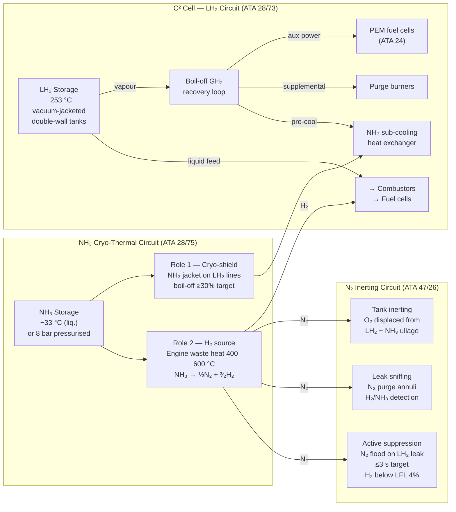

# ID-A360-Q100

## IDEALE-ESG · AMPEL360 Program Family · 100-Pax Configuration

### Zero-CO₂ Short-Haul Aircraft — LH₂ + On-Board NH₃ Cracking + Closed-Loop N₂ Inerting

<p align="center">
  
  
  
  
  
  
  
  
  
  
</p>

<p align="center">
  <strong>
    Certification-grade digital engineering baseline for a 100-passenger
    zero-CO₂ short-haul aircraft powered by Liquid Hydrogen with on-board
    Ammonia cracking and closed-loop Nitrogen inerting — managed under the
    OPT-IN Framework, S1000D CSDB, and Teknia Token incentive system.
  </strong>
</p>

<p align="center">
  <a href="#1-program-identity">Identity</a> •
  <a href="#2-four-dimensional-ata-node-model">4D Model</a> •
  <a href="#3-propulsion-architecture">Propulsion</a> •
  <a href="#4-repo-organization">Repo</a> •
  <a href="#5-opt-in-5-axis-topology">OPT-IN</a> •
  <a href="#6-elastic-lifecycle">ELC</a> •
  <a href="#7-knot-register">KNOTs</a> •
  <a href="#8-tokenomics-tt-v314">Tokenomics</a> •
  <a href="#9-csdb--publishing-model">CSDB</a> •
  <a href="#10-standards--compliance">Standards</a> •
  <a href="#11-automation--cicd">Automation</a> •
  <a href="#12-contributing">Contributing</a>
</p>

---

## 1. Program Identity

| Attribute | Value |
|---|---|
| **Designation** | `ID-A360-Q100` |
| **ID** | IDEALE-ESG sub-brand prefix |
| **A360** | AMPEL360 program family heritage |
| **Q100** | Configuration — 100 passengers nominal (range 50–120 pax) |
| **AMPEL** | Program family name (see [Acknowledgments](#acknowledgments)) |
| **ESG pillar** | Environmental — net-zero aviation decarbonization |
| **Configuration** | Conventional tube-and-wing, clean-sheet design |
| **Range target** | ≤ 2 500 km short-haul regional |
| **Pax nominal** | 100 (range 50–120) |
| **Certification basis** | EASA CS-25 Amendment 28 / FAA Part 25 (final basis confirmed per application date) |
| **CO₂ posture** | Zero at tailpipe (tank-to-wake). Lifecycle CO₂ depends on H₂/NH₃ production pathway — declared in I-INFRASTRUCTURES |
| **NOₓ target** | ≤ 5% of ICAO CAEP/8 LTO NOₓ limit (2010 baseline; re-validate at certification entry date) |
| **Domain governance** | `aircraftmodel.eu` — aviation decarbonization boundary |
| **Sibling program** | AMPEL360 BWB (quantum-enhanced, blended-wing-body) |
| **Inheritance boundary** | [`AMPEL360-FAM-IBD-001 Rev B`](SSOT/LC04_DESIGN_REVIEW/AMPEL360-FAM-IBD-001-RevB.md) — shared-spine / forked-content declaration |
| **Repository** | `github.com/AmedeoPelliccia/aircraftmodel` |
| **Concept & Direction** | Amedeo Pelliccia |

> **⚠ Domain boundary:** This repository operates exclusively under the
> `aircraftmodel.eu` governance charter (aviation decarbonization).
> Space-quantum and orbital infrastructure artifacts belong to
> `aerospacemodel.com`. Do not co-mingle across domain boundaries.

---

## 2. Four-Dimensional ATA Node Model

Every ATA chapter node in this programme carries **four orthogonal attributes**. These dimensions
are independent — they do not overlap and do not compete.

| Dimension | Attribute | Question answered | Governed by |
|---|---|---|---|
| **① STRUCTURE** | OPT-IN axis / cluster | *Where* does this system live in the repo? | [§5 OPT-IN 5-Axis Topology](#5-opt-in-5-axis-topology) |
| **② TIME** | ELC Family code → SLC phases → zone | *How* does it mature through the lifecycle? | [§6 Elastic Lifecycle](#6-elastic-lifecycle) · [`SSOT/README.md`](SSOT/README.md) |
| **③ UNCERTAINTY** | KNOT / KNU register | *What* do we not yet know about it? | [§7 KNOT Register](#7-knot-register) |
| **④ INCENTIVE** | TT token pool | *Who* gets rewarded for resolving uncertainty? | [§8 Tokenomics](#8-tokenomics-tt-v314) |

> **OPT-IN and ELC are orthogonal, not competing taxonomies.**
> OPT-IN defines the *spatial* organisation of content — which axis and cluster hosts an ATA node.
> ELC / Family codes define the *temporal* schedule — how that node matures through its lifecycle.
> Family codes (A–G) are an attribute carried by each ATA node (derived from its physical
> architecture), not a separate structural taxonomy.

---

## 3. Propulsion Architecture

### 3.1 Overview — The Closed-Loop Cryogenic Ecosystem

The ID-A360-Q100 propulsion system represents the convergence of Liquid Hydrogen
(LH₂) and Ammonia (NH₃) into a single self-reinforcing energy ecosystem:

- **LH₂** provides primary combustion energy (high energy density, zero CO₂ at tailpipe)
- **NH₃** acts as a dual-role agent: cryo-thermal shield for LH₂ lines *and*
  a secondary H₂ source via on-board catalytic cracking
- **N₂** produced by the cracker is captured and used as an active inert-gas
  safety agent by ATA 47 — turning a by-product into a safety resource

This tri-species closed loop eliminates boil-off venting, maximises energy
recovery, and generates its own inerting gas on-board.

> **Baseline posture (v0.1):** This repository defines a concept baseline and
> evidence plan. Performance, mass, emissions, and certification statements are
> **targets** until closed by LC02–LC07 evidence under the KNOT/KNU framework.
> No claim in this document constitutes a certified or substantiated design value.



### 3.2 ATA 28 — LH₂ Fuel Management & Boil-Off Control

Liquid hydrogen is stored at −253 °C in vacuum-jacketed double-wall tanks.

**Tank design:** Double-wall, vacuum-insulated. Candidate inner-wall material:
Al-Li 2195 alloy (subject to H₂-compatibility trade study — material selection
not yet substantiated). Contamination and cryogenic degradation modes
(including H₂ compatibility) are mitigated by material cleanliness,
moisture/oxygen exclusion coordinated with ATA 47, and surface treatment.
Tank pressure band: 1.5–3.5 bar absolute.

**Boil-off recovery loop** — GH₂ rising from natural vaporisation is never
vented. The ATA 28 controller routes it to one of three sinks in priority order:

1. PEM fuel cells → auxiliary electrical generation (ATA 24)
2. Engine purge burners → supplemental thrust
3. NH₃ sub-cooling heat exchanger → extends liquid hold time

**NH₃ cryo-shield integration:** Liquid ammonia circulates in a heat-exchanger
jacket surrounding the LH₂ feedlines. As an intermediate refrigerant at −33 °C,
it intercepts parasitic heat before it reaches the LH₂ stream, reducing
boil-off rate by ≥ 30 % (target — KNOT-ATA28-20-00-001).

### 3.3 NH₃ On-Board Cracker — Dual Role

| Function | Mechanism | ATA Reference |
|---|---|---|
| **Cryo-thermal shield** | NH₃ jacket around LH₂ lines; acts as intermediate refrigerant | ATA 28-20 |
| **Supplemental H₂ source** | Catalytic cracker uses engine waste heat: NH₃ → ½N₂ + 3/2 H₂ | ATA 28-40 / 75 |
| **N₂ generator** | N₂ from cracking captured and routed to ATA 47 inerting system | ATA 47-10 |

**Cracker thermodynamics:** NH₃ decomposition is endothermic (ΔH = +46 kJ/mol
NH₃). Balanced per mol NH₃: NH₃ → ½N₂ + 3/2 H₂ (equivalently: 2NH₃ → N₂ + 3H₂
per two moles — same stoichiometry). Engine bleed or waste heat at 400–600 °C
drives the reaction over a Ru/Al₂O₃ catalyst. Conversion efficiency target:
≥ 95 % at cruise conditions (target — KNOT-ATA28-40-00-001).

### 3.4 ATA 47 — Inert Gas System & Safety Orchestration

> **Naming:** ATA 47 is scoped as an **Inert Gas System**. The N₂ is generated
> as a means to an end (inerting + suppression), not as a product in its own right.

| Mode | Trigger | Action |
|---|---|---|
| **Continuous inerting** | Always-on during fuel operations | N₂ blanket in LH₂ + NH₃ tank ullage; O₂ < 2 % v/v |
| **Leak sniffing** | Periodic / continuous | N₂ pressurises inter-pipe annuli; downstream sensors monitor for H₂ or NH₃ |
| **Alarm cascade** | H₂ or NH₃ detected in N₂ exhaust | ATA 28 valve isolation + ATA 26 crew alert |
| **Active suppression** | LH₂ leak confirmed | High-pressure N₂ flood of affected zone; H₂ diluted below LFL (4 % v/v) within ≤ 3 s (target) |

**N₂ source:** Cracker exhaust — contaminant limits (NH₃, H₂, H₂O) to be
defined by ATA 47 safety case; target purity TBD per KNOT-ATA47-10-00-001.
Supplemented by a conventional molecular-sieve generator as back-up when the
cracker is not running (ground, engine-out).

### 3.5 Material Compatibility — Cross-Cutting (ATA 20 / 51)

All material data is centralised in the
[Material Characterization Library](OPT-IN_FRAMEWORK/T-TECHNOLOGIES/M-MECHANICS/ATA_20-STANDARD_PRACTICES/material-library/README.md).
All selections are **candidates** pending LC03/LC06 evidence.

| Species | Degradation mode | Candidate mitigation |
|---|---|---|
| **H₂** | H₂ compatibility / cryogenic material degradation | Candidate: Ti-6Al-4V for H₂-wetted surfaces (trade study open); ATA 47 O₂/H₂O/moisture exclusion; cleanliness |
| **NH₃** | Stress-corrosion cracking (SCC) of Cu alloys; N-assisted fatigue | Candidate: Hastelloy C-276 for NH₃-wetted surfaces (trade study open); N₂ drying |

### 3.6 Closed-Loop Synergy Summary

| Function | System | Action |
|---|---|---|
| LH₂ storage | ATA 28-10 | Maintains −253 °C; manages vapour pressure |
| Cryo cooling | NH₃ jacket (ATA 28-20) | Reduces LH₂ boil-off by ≥ 30 % (target) |
| H₂ supplementation | Cracker (ATA 28-40) | NH₃ → H₂ added to fuel bus |
| N₂ generation | ATA 47-10 (cracker exhaust) | Feeds inerting and suppression systems |
| Tank inerting | ATA 47-20 | O₂ < 2 % v/v in all fuel ullages |
| Leak detection | ATA 47-30 | Sniff protocol; continuous |
| Active suppression | ATA 47-40 | N₂ flood within ≤ 3 s (target) |
| Embrittlement control | ATA 20 / 51 | Material selection + O₂/H₂O exclusion (trade studies open) |

---

## 4. Repo Organization

```
ID-A360-Q100/
│
├── README.md                              ← This file (① STRUCT: root)
├── CONTRIBUTING.md                        ← Contributor loop + placement rules
├── requirements.txt                       ← Python toolchain
│
├── OPT-IN_FRAMEWORK/                      ← 5-axis engineering topology (① STRUCTURE)
│   ├── O-ORGANIZATIONS/                   ATA 00–05 · SHARED
│   ├── P-PROGRAMS/                        ATA 06–12 · SHARED
│   ├── T-TECHNOLOGIES/                    ATA 20–98 on-board systems
│   │   ├── C2-CIRCULAR_CRYOGENIC_CELLS/   ★ ATA 28 (LH₂ + NH₃) · FORKED
│   │   ├── E1-ENVIRONMENT/                ★ ATA 47 (N₂ inerting) · FORKED
│   │   ├── E2-ENERGY/                     ATA 24 / 49 · FORKED
│   │   ├── M-MECHANICS/                   ATA 20, 27, 29, 32 · SHARED/FORKED
│   │   │   └── ATA_20-STANDARD_PRACTICES/
│   │   │       └── material-library/      ★ Centralised material data
│   │   └── P-PROPULSION/                  ATA 54, 60–83 · FORKED
│   ├── I-INFRASTRUCTURES/                 H₂ / NH₃ GSE, cryo logistics · MIXED
│   └── N-NEURAL_NETWORKS/                 Traceability, DPP, ledger (ATA 96–98) · SHARED
│
├── SSOT/                                  ← Engineering truth (② TIME + ③ UNCERTAINTY)
│   ├── README.md                          ← ELC document: AMPEL360-FAM-ARCH-ELC-001 Rev B
│   ├── LC01_PROBLEM_STATEMENT/            KNOTS · KNU_PLAN · TIMELINE · RACI · TT
│   ├── LC02 – LC11 .../                   SLC phases (COMPRESS → EXTEND)
│   ├── LC12_RECONDITIONING/               Reconditioning loop (EXTEND zone)
│   └── LC05_ANALYSIS_MODELS/
│       └── thermodynamic-models/          ★ OpenModelica baselines (LH₂/NH₃/N₂)
│
├── PUB/                                   ← Controlled deliverables
│   └── CSDB/
│       ├── DM/   PM/   DML/   ICN/
│       ├── BREX/ BREX-IDA360-Q100-v0.1.xml
│       ├── COMMON/   APPLICABILITY/
│       ├── EXPORT/   IETP/
│
├── CAOS/                                  Continuous Airworthiness & Ops Sustainment
├── finance/ledger.json                    SHA-256 hash-chain TT ledger (④ INCENTIVE)
│
├── tools/
│   ├── ci/
│   │   ├── optin_structure_validator.py   ★ Structure + traceability linter
│   │   ├── brex_validator.py              ★ BREX rules 001–005 enforcer
│   │   └── knot_issues_sync.py            ★ KNOT/KNU → GitHub Issues sync
│   └── knu_distribution.py               ★ TT distribution calculator + ledger
│
└── .github/
    ├── hooks/
    │   ├── pre-commit                     ★ SSOT boundary + traceability check
    │   └── setup-hooks.sh
    └── workflows/
        ├── brex-validation.yml            ★ BREX CI on PUB/CSDB/** changes
        ├── tt-distribution.yml            ★ Auto TT award on PR merge
        └── knot-issues-sync.yml           ★ CSV → GitHub Issues on push
```

**Placement rule:**

| Artifact is... | Place in... |
|---|---|
| Authoritative engineering evidence | `SSOT/` |
| Publishable or deliverable | `PUB/` |
| Formatted output (PDF, HTML, DOCX) | `PUB/EXPORT/` — **never** `SSOT/` |

---

## 5. OPT-IN 5-Axis Topology

Full inheritance from AMPEL360-COMMON spine per
[`OPT-IN_FRAMEWORK/README.md`](OPT-IN_FRAMEWORK/README.md).
Inheritance boundary (SHARED / FORKED / MIXED) per
[`AMPEL360-FAM-IBD-001 Rev B`](SSOT/LC04_DESIGN_REVIEW/AMPEL360-FAM-IBD-001-RevB.md).
Programme-specific extensions for AMPEL360 WTW marked ★.

### Axis O — ORGANIZATIONS (ATA 00–05) · `SHARED`

| ATA | Title | IBD Status |
|---|---|---|
| ATA 00 | General | SHARED |
| ATA 01 | Maintenance Policy | SHARED |
| ATA 02 | Weight & Balance | SHARED |
| ATA 03 | Minimum Equipment | SHARED |
| ATA 04 | Airworthiness Limitations | SHARED |
| ATA 05 | Time Limits / Maintenance Checks | SHARED |

```
OPT-IN_FRAMEWORK/O-ORGANIZATIONS/
└── ATA_00–05-GENERAL/
```

### Axis P — PROGRAMS (ATA 06–12) · `SHARED`

| ATA | Title | IBD Status |
|---|---|---|
| ATA 06 | Dimensions & Areas | SHARED |
| ATA 07 | Levelling & Weighing | SHARED |
| ATA 08 | Levelling (alt) | SHARED |
| ATA 09 | Towing & Taxiing | SHARED |
| ATA 10 | Parking & Mooring / Storage | SHARED |
| ATA 11 | Placards & Markings | SHARED |
| ATA 12 | Servicing | SHARED |

```
OPT-IN_FRAMEWORK/P-PROGRAMS/
└── ATA_06–12-PROGRAMMES/
```

### Axis T — TECHNOLOGIES

The T axis is divided into clusters. Each cluster maps to one or more ATA chapters.
SHARED clusters are inherited from `AMPEL360-COMMON`; FORKED clusters are WTW-specific.

#### T/C2 — Circular Cryogenic Cells ★★ · `FORKED` (critical path)

> Primary innovation node. LH₂ tri-species fuel architecture unique to AMPEL360 WTW.

| ATA | Title | IBD Status |
|---|---|---|
| ATA 28 | Fuel (LH₂ + NH₃ tri-species) ★★ | FORKED |
| ATA 85 | Reciprocating Engine Fuel & Control (cryo variant) ★★ | FORKED |

```
OPT-IN_FRAMEWORK/T-TECHNOLOGIES/C2-CIRCULAR_CRYOGENIC_CELLS/
├── ATA_28-FUEL/
│   ├── 28-10-storage-reservoir/           ★ LH₂ at −253 °C
│   ├── 28-20-distribution/                ★ NH₃ at −33 °C / 8 bar
│   ├── 28-30-dump-jettison/               ★ GH₂ management loop
│   ├── 28-40-indicating/                  ★ NH₃ → H₂ + N₂ catalyst
│   └── ATA-28-fuel/                       ★ Full sub-chapter tree (legacy)
│       ├── 28-10-lh2-storage-vacuum-tank/
│       ├── 28-20-nh3-storage-and-cryo-shield/
│       ├── 28-30-boil-off-recovery-and-routing/
│       ├── 28-40-nh3-cracker-h2-feed/
│       ├── 28-70-embrittlement-monitoring/
│       └── 28-90-tables-schemas-index/
```

#### T/E1 — Environment (ECS, Fire, Inerting) ★★ · `FORKED` (inerting) / `SHARED` (ECS, anti-ice)

| ATA | Title | IBD Status |
|---|---|---|
| ATA 21 | Air Conditioning | SHARED |
| ATA 26 | Fire Protection (H₂+NH₃ dual-species zones) ★★ | FORKED |
| ATA 30 | Ice & Rain Protection | SHARED |
| ATA 36 | Pneumatic | SHARED |
| ATA 47 | Inert Gas System (N₂ from cracker) ★★ | FORKED |

```
OPT-IN_FRAMEWORK/T-TECHNOLOGIES/E1-ENVIRONMENT/
└── ATA_47-INERT_GAS_SYSTEM/
    └── ATA-47-inert-gas-system/
        ├── 47-10-cracker-n2-sourcing-and-purity/   ★
        ├── 47-20-tank-inerting-management/          ★
        ├── 47-30-leak-sniff-protocol/               ★
        ├── 47-40-active-suppression-system/         ★
        ├── 47-50-backup-mol-sieve-generator/        ★
        └── 47-90-tables-schemas-index/
```

#### T/E2 — Energy · `FORKED`

| ATA | Title | IBD Status |
|---|---|---|
| ATA 24 | Electrical Power (generator + FC auxiliary) | FORKED |
| ATA 49 | Airborne Auxiliary Power | FORKED |

```
OPT-IN_FRAMEWORK/T-TECHNOLOGIES/E2-ENERGY/
```

#### T/M — Mechanics · `SHARED` (hydraulics) / `FORKED` (flight controls, landing gear)

| ATA | Title | IBD Status |
|---|---|---|
| ATA 20 | Standard Practices — Airframe | SHARED |
| ATA 27 | Flight Controls | FORKED |
| ATA 29 | Hydraulic Power | SHARED |
| ATA 32 | Landing Gear | FORKED |

```
OPT-IN_FRAMEWORK/T-TECHNOLOGIES/M-MECHANICS/
└── ATA_20-STANDARD_PRACTICES/
    └── material-library/    ★ Centralised material data (H₂ + NH₃ compatibility)
```

#### T/P — Propulsion ★ · `FORKED` (turbine combustion + open fan)

| ATA | Title | IBD Status |
|---|---|---|
| ATA 54 | Nacelles / Pylons | FORKED |
| ATA 60 | Standard Practices — Engine | FORKED |
| ATA 61 | Propeller / Propulsor | FORKED |
| ATA 70 | Standard Practices — Engine | FORKED |
| ATA 71 | Power Plant — General | FORKED |
| ATA 72 | Engine — Turbine/Turboprop | FORKED |
| ATA 73 | Engine Fuel & Control | FORKED |
| ATA 74 | Ignition | FORKED |
| ATA 75 | Air — Bleed / Waste-Heat Routing ★ | FORKED |
| ATA 76 | Engine Controls | FORKED |
| ATA 77 | Engine Indicating | FORKED |
| ATA 78 | Exhaust | FORKED |
| ATA 79 | Oil | FORKED |
| ATA 80 | Starting | FORKED |
| ATA 81 | Turbines (Reciprocating Engines) | FORKED |
| ATA 82 | Water Injection | FORKED |
| ATA 83 | Accessory Gear Boxes | FORKED |

```
OPT-IN_FRAMEWORK/T-TECHNOLOGIES/P-PROPULSION/
└── ATA_75-AIR/
    └── ATA-75-air/
        └── 75-20-waste-heat-routing-to-cracker/   ★ Engine bleed/exhaust → 400–600 °C
```

#### T/S — Structures · `SHARED` (std practices, material library) / `FORKED` (geometry)

| ATA | Title | IBD Status |
|---|---|---|
| ATA 51 | Standard Practices — Structures | SHARED |
| ATA 52 | Doors | FORKED |
| ATA 53 | Fuselage ★ (diameter / stretch trade) | FORKED |
| ATA 55 | Stabilizers ★ (T-tail vs canard trade) | FORKED |
| ATA 56 | Windows | FORKED |
| ATA 57 | Wings | FORKED |

#### T/A2 — Avionics · `MIXED` (core SHARED, FBW laws FORKED)

| ATA | Title | IBD Status |
|---|---|---|
| ATA 22 | Auto Flight | MIXED |
| ATA 34 | Navigation | MIXED |
| ATA 42 | Integrated Modular Avionics (IMA) | MIXED |

#### T/D — Data · `SHARED`

| ATA | Title | IBD Status |
|---|---|---|
| ATA 31 | Instruments / Indicating & Recording | SHARED |
| ATA 45 | Central Maintenance System (CMS) | SHARED |

#### T/C1 — Communications · `SHARED`

| ATA | Title | IBD Status |
|---|---|---|
| ATA 23 | Communications | SHARED |

#### T/L — Life Support & Cabin · `MIXED` (cabin SHARED, layout FORKED)

> ATA 21 (ECS), ATA 30 (Ice/Rain), ATA 36 (Pneumatic) are hosted under T/E1-ENVIRONMENT
> per AMPEL360-COMMON. The chapters below are the remaining life-support / cabin entries.

| ATA | Title | IBD Status |
|---|---|---|
| ATA 25 | Equipment / Furnishings | MIXED |
| ATA 33 | Lights | SHARED |
| ATA 35 | Oxygen | SHARED |
| ATA 37 | Vacuum | SHARED |
| ATA 38 | Water / Waste | SHARED |
| ATA 44 | Cabin Systems | MIXED |
| ATA 50 | Cargo & Accessory Compartments | MIXED |

### Axis I — INFRASTRUCTURES · `MIXED` (H₂ GSE SHARED, NH₃ GSE FORKED)

| Scope | Title | IBD Status |
|---|---|---|
| H₂ supply chain (IN-10–IN-90) | Green H₂ production, storage, tankers | SHARED |
| NH₃ sourcing & logistics | NH₃ procurement unique to WTW ★ | FORKED |
| LH₂ GSE | Cryo ground support equipment | SHARED |
| NH₃ GSE ★ | NH₃-specific couplings, hoses, interfaces | FORKED |

```
OPT-IN_FRAMEWORK/I-INFRASTRUCTURES/
├── ATA_IN_H2_GSE_AND_SUPPLY_CHAIN/
│   └── IN-50-nh3-gse-couplings-hoses-interfaces/   ★ NH₃-specific
└── ATA_12-SERVICING_INFRA/
    └── 12-10-replenishing-equipment-and-points/     ★ Dual-species refuelling panel
```

### Axis N — NEURAL NETWORKS · `SHARED`

Traceability, DPP, ledger, tokenomics governance framework — identical for both programmes.

| ATA | Title | IBD Status |
|---|---|---|
| ATA 46 | Information Systems | SHARED |
| ATA 91 | Wiring Charts | SHARED |
| ATA 92 | Electrical System Installation | SHARED |
| ATA 95 | Special / Emerging Technology Oversight | SHARED |
| ATA 96 | Programme Governance & Traceability | SHARED |
| ATA 97 | AI/ML Model Governance & Synthetic Data | SHARED |
| ATA 98 | DPP / Tokenomics Framework | SHARED |

```
OPT-IN_FRAMEWORK/N-NEURAL_NETWORKS/
└── ATA_96/
    └── 96-70-governance-policies-and-rules/    IBCR register
```

### IBD-001 Boundary Summary

Per [`AMPEL360-FAM-IBD-001 Rev B`](SSOT/LC04_DESIGN_REVIEW/AMPEL360-FAM-IBD-001-RevB.md) §7
— 23 boundary entries:

| Designation | Count | Key entries |
|---|---|---|
| **SHARED** | 12 | ATA 00–12, ATA 20/51, ATA 21/29/30/36, ATA 23/31/45/46, ATA 95–98, H₂ GSE |
| **FORKED** | 8 | ATA 24/26/27/28/32/47/49, ATA 52–57, ATA 60–83, NH₃ GSE |
| **MIXED** | 3 | ATA 25/44/50 (cabin shared, layout forked), ATA 22/34/42 (core shared, FBW laws forked), Infrastructure (H₂ shared, NH₃ forked) |

---

## 6. Elastic Lifecycle

> **Reference document:** [`SSOT/README.md`](SSOT/README.md) —
> *Architectural Models Programming Elastic Lifecycle* ·
> `AMPEL360-FAM-ARCH-ELC-001 · Rev B · 2026-02-23`

The Elastic Lifecycle (ELC) is the **temporal** dimension of every ATA node.
It defines how a system's content matures from initial uncertainty through
certification and into extended service. OPT-IN is spatial; ELC is temporal.

### 6.1 Three-Zone Model

```mermaid
graph LR
    subgraph COMPRESS["COMPRESS — TTO Reduction"]
        direction LR
        SLC01["SLC01\nUncertainty"] --> SLC02["SLC02\nRequirements"] --> SLC03["SLC03\nPrelim Design"]
        SLC03 --> SLC04["SLC04\nDesign Review"] --> SLC05["SLC05\nAnalysis"] --> SLC06["SLC06\nTesting"]
        SLC06 --> SLC07["SLC07\nProcess Qual"] --> SLC08["SLC08\nFlight Test\n& Cert"]
    end
    subgraph TRANSITION["TRANSITION"]
        EIS["EIS Gate"]
    end
    subgraph EXTEND["EXTEND — Operational Life"]
        direction LR
        SLC09["SLC09\nIndustrial Plan"] --> SLC10["SLC10\nFleet Ops"] --> SLC11["SLC11\nMRO"]
        SLC11 -->|loop| SLC12["SLC12\nRecondition\n(×4 max)"]
        SLC12 -->|next cycle| SLC11
    end
    COMPRESS --> TRANSITION --> EXTEND

    style COMPRESS fill:#1a365d,stroke:#2b6cb0,color:#fff
    style TRANSITION fill:#553c9a,stroke:#805ad5,color:#fff
    style EXTEND fill:#22543d,stroke:#38a169,color:#fff
```



| Zone | Phases | Lever | Metric |
|---|---|---|---|
| **COMPRESS** | SLC01–SLC08 | Concurrent phases, virtual qualification, digital twin, early supplier engagement | `TTO = T₀ − ΔT₁` → minimum |
| **TRANSITION** | EIS gate | Programme freeze, TC issued | — |
| **EXTEND** | SLC09–SLC11 (+SLC12 loop) | Condition-based maintenance, modular reconditioning, DPP circularity | `t_ops` → maximum |

> **Total Lifecycle Value = f(1 / TTO, t_ops).**
> Target elasticity ratio: `η_elastic = t_ops / TTO ≥ 10` (programme).

### 6.2 ELC Compiler — Architecture → Lifecycle

The ELC Compiler translates architectural models into an executable lifecycle
programme in six steps:

| Step | Input | Output |
|---|---|---|
| **C1** | Architectural models (functional, physical, logical, operational views) | SLC phase sequence |
| **C2** | System properties (TRL, DAL, make/buy, modularity) | Phase parameters |
| **C3** | Certification constraints (CS-25, SC-H₂) | Gate criteria |
| **C4** | Interface dependencies (cross-ATA coupling) | Dependency graph |
| **C5** | Concurrency analysis (which phases can overlap) | Concurrency map |
| **C6** | Elasticity targets (η_elastic ≥ 10) | `ELC_INSTANCE.yaml` |

The compiled output (`ELC_INSTANCE.yaml`) lives alongside each ATA node:
`OPT-IN_FRAMEWORK/.../ATA_XX/SSOT/ELC_INSTANCE.yaml`

See [`SSOT/LC05_ANALYSIS_MODELS/ELC_COMPILER/`](SSOT/LC05_ANALYSIS_MODELS/) for
the compiler implementation (`compiler.py`, `scheduler.py`, `metrics.py`).

### 6.3 Family Classification — Temporal Scheduling (ELC Compiler Step 1)

Family codes (A–G) are the **temporal scheduling** attribute of each ATA node.
They are derived from the physical architecture and determine which SLC template
applies. They are **not** a competing structural taxonomy — each ATA node already
has a structural home (OPT-IN axis/cluster) and a temporal track (Family code).

| Family | Domain | Template | ELC pacemaker role |
|---|---|---|---|
| **A** | Structures | `family_A_structures.yaml` | Material allowables drive SLC03–SLC06 |
| **B** | Propulsion | `family_B_propulsion.yaml` | Engine TRL drives compression phase depth |
| **C** | Novel H₂ / Cryo | `family_C_novel_h2.yaml` | Low TRL → full compression required (no phase collapse) |
| **D** | Supplier Furnished Equipment | `family_D_sfe.yaml` | Supplier qualification gates |
| **E** | Avionics / Software | `family_E_avionics_sw.yaml` | DO-178C/254 phases |
| **F** | BFE / Cabin | `family_F_bfe_cabin.yaml` | Cabin configuration gates |
| **G** | AI / ML | `family_G_ai_ml.yaml` | Model governance + synthetic data |

> **Family assignments** are declared in `SSOT/LC01_PROBLEM_STATEMENT/ELC_FAMILY_ASSIGNMENTS.csv`
> and are an auditable attribute of every ATA node per ELC Rev B §11.

---

## 7. KNOT Register

`LC01_PROBLEM_STATEMENT` is the controlled uncertainty orchestration layer at every ATA node.

```
SSOT/LC01_PROBLEM_STATEMENT/
├── KNOTS.csv              Uncertainty register (known unknowns)
├── KNU_PLAN.csv           Expected knowledge units per KNOT
├── TIMELINE.csv           Milestones and dates
├── RACI.csv               Stakeholder responsibility matrix
├── TOKENOMICS_TT.yaml     TT reward pool and allocation parameters
├── ELC_FAMILY_ASSIGNMENTS.csv   ATA → ELC Family mapping
└── AWARDS_TT.csv          Actual TT distributions (populated at closure)
```

### Token Distribution Formula

```
w_i = α · Ê_i + (1 − α) · Î_i      T_i = P_k · w_i
```

| Symbol | Meaning | Default |
|---|---|---|
| `P_k` | TT pool allocated to KNOT k | per KNOTS.csv |
| `T_i` | Token allocation for contributor i = P_k · w_i | — |
| `w_i` | Composite weight for contributor i | — |
| `α` | Effort weight | 0.30 |
| `1-α` | Impact weight | 0.70 |
| `Ê_i` | Normalised effort = E_i / Σ E_i | — |
| `Î_i` | Normalised impact = I_i / Σ I_i | — |
| `I_i` | Effective impact = ΔR_k,i + λ · S_i | — |
| `λ` | Spillover multiplier | 0.50 |

### KNOT Closure Criteria

1. ✅ All planned KNUs → `COMPLETE` or `ACCEPTED`
2. ✅ Residual ≤ target (e.g. 100 → ≤ 10)
3. ✅ All PUB artifacts pass BREX validation
4. ✅ All trace links resolve (no dangling references)
5. ✅ Signoffs captured in evidence pack
6. ✅ TT rewards distributed and logged in `finance/ledger.json`

### Seed KNOT Register

Full register: `SSOT/LC01_PROBLEM_STATEMENT/KNOTS.csv`

| KNOT_ID | Title | Res. | Target | Pool (TT) | Close |
|---|---|---|---|---|---|
| KNOT-ATA28-10-00-001 | LH₂ Tank Structural Sizing | 100 | 10 | 120 | 2026-09-30 |
| KNOT-ATA28-20-00-001 | NH₃ Cryo-Shield Boil-Off Reduction | 100 | 10 | 150 | 2026-12-31 |
| KNOT-ATA28-40-00-001 | NH₃ Cracker Conversion Efficiency | 100 | 15 | **200** | 2027-03-31 |
| KNOT-ATA47-10-00-001 | Cracker N₂ Purity / Contaminants | 100 | 10 | 100 | 2027-03-31 |
| KNOT-ATA47-20-00-001 | Tank Inerting O₂ Control | 100 | 8 | 130 | 2027-06-30 |
| KNOT-ATA47-30-00-001 | Leak Sniff Protocol Sensitivity | 100 | 10 | 110 | 2027-06-30 |
| KNOT-ATA47-40-00-001 | Active N₂ Suppression ≤ 3 s | 100 | 5 | **180** | 2027-09-30 |
| KNOT-ATA28-70-00-001 | H₂ Embrittlement Monitoring | 100 | 12 | 90 | 2027-06-30 |
| KNOT-ATA75-20-00-001 | Waste Heat Routing to Cracker | 100 | 15 | 100 | 2026-12-31 |
| KNOT-ATA04-00-00-001 | ALIs for Cryo Systems | 100 | 10 | 80 | 2027-09-30 |
| KNOT-ATA53-10-00-001 | Fuselage Diameter Trade (IBD OI-1) | 100 | 15 | 100 | 2026-09-30 |
| KNOT-ATA32-10-00-001 | Landing Gear Yehudi Interference (IBD OI-3) | 100 | 15 | 90 | 2026-12-31 |
| KNOT-ATA55-10-00-001 | CG Envelope T-tail vs Canard (IBD OI-4) | 100 | 15 | 110 | 2026-12-31 |
| KNOT-ATA25-50-00-001 | NH₃ Containment Zone Crashworthiness (IBD OI-5) | 100 | 12 | 100 | 2027-06-30 |
| **TOTAL** | | | | **1 660 TT** | |

> **Critical path:** KNOT-ATA28-40-00-001 (Cracker Efficiency) is the anchor.
> ATA 47 inerting and waste heat routing are downstream dependencies.
> IBD open items (OI-1 through OI-5) feed the WTW viability gate per
> [`AMPEL360-FAM-IBD-001 Rev B`](SSOT/LC04_DESIGN_REVIEW/AMPEL360-FAM-IBD-001-RevB.md).

---

## 8. Tokenomics — TT v3.14

```yaml
# TOKENOMICS_TT.yaml template (per KNOT)
allocation:
  method: "effort_plus_impact"
  params:
    alpha_effort: 0.30      # 30% weight on effort
    alpha_impact: 0.70      # 70% weight on impact
    lambda_spillover: 0.50  # cross-KNOT spillover credit
```

| Operation | Fee Rate |
|---|---|
| KNU reward distribution | 0.5% |
| Transfer (π-tier) | 0.314% |
| Transfer (standard) | 0.99% |
| Transfer (large) | 3.14% |

Ledger: `finance/ledger.json` — SHA-256 hash chain, append-only.

---

## 9. CSDB & Publishing Model

### BREX — Five Mandatory Project Rules

| Rule | Scope | Requirement | CI behaviour |
|---|---|---|---|
| `BREX-IDA360-001` | ATA 28 DMs | `<cautionRef>` to H₂ compatibility caution | **FAIL build** |
| `BREX-IDA360-002` | Any DM with NH₃ content | `<warningRef>` to NH₃ toxicity warning | **FAIL build** |
| `BREX-IDA360-003` | ATA 47-40 procedural DMs | `respTime` attribute (seconds) on all steps | **FAIL build** |
| `BREX-IDA360-004` | All DMs with applicability | Use only approved variant values | **FAIL build** |
| `BREX-IDA360-005` | ATA 26 / 28 / 47 DMs | `safetyClass="SC1"` on `dmStatus` | **FAIL build** |

---

## 10. Standards & Compliance

| Standard | Application |
|---|---|
| **EASA CS-25 Amdt 28 / FAA Part 25** | Airworthiness requirements framing (final certification basis confirmed per application date) |
| **EASA SC-H₂ Special Condition (draft)** | Liquid hydrogen fuel system requirements |
| **ATA iSpec 2200** | Chapter / section / subject scaffolding |
| **S1000D Issue 5.0** | Technical publications CSDB (BREX-IDA360-Q100-v0.1) |
| **DO-178C** | Software — fuel management + inerting controllers |
| **DO-254** | Hardware — cracker controller, N₂ suppression valve driver |
| **DO-160H** | Environmental qualification for cryo-zone electronics |
| **SAE AS6858** | Hydrogen fuel system airworthiness (reference) |
| **ISO 15926** | Industrial data lifecycle standards |
| **REACH / CLP** | NH₃ handling chemical classification (ground ops) |

---

## 11. Automation & CI/CD

Install the full automation layer:

```bash
pip install -r requirements.txt
bash .github/hooks/setup-hooks.sh
```

### GitHub Actions Workflows

| Workflow | Trigger | What it does |
|---|---|---|
| `brex-validation.yml` | PR / push → `PUB/CSDB/**` | XML well-formedness; BREX-IDA360-001–005; ICN reference resolution. **Fails build on violation.** |
| `tt-distribution.yml` | PR merged containing KNU ID | Runs distribution formula; commits `AWARDS_TT.csv` + `ledger.json`; posts award summary to PR. |
| `knot-issues-sync.yml` | Push → `LC01/*.csv` or manual | Parses KNOTS + KNUs; creates/updates GitHub Issues with ATA labels and status. |

### Pre-Commit Hook

Rejects at commit time:

- `.pdf`, `.html`, `.docx` anywhere in `SSOT/`
- Raw `.csv` inside `PUB/CSDB/DM/`
- LC02–LC14 artifacts (> 5 lines) with no KNU ID reference
- Commit messages with no KNU/KNOT ID and no exempt prefix (`chore:`, `ci:`, `docs:`, `fix:`)

### Local Commands

```bash
# Structure validation
python tools/ci/optin_structure_validator.py --check
python tools/ci/optin_structure_validator.py --check --chapter 28
python tools/ci/optin_structure_validator.py --check --strict   # warnings = errors

# BREX validation
python tools/ci/brex_validator.py --dm-dir PUB/CSDB/DM

# TT tooling
python tools/knu_distribution.py quote --op reward --tt 200
python tools/knu_distribution.py verify
```

### Thermodynamic Simulation Baseline (LC05)

`SSOT/LC05_ANALYSIS_MODELS/thermodynamic-models/` defines OpenModelica 1D
simulation standard — one folder per KNOT, `KNU_EVIDENCE.md` template with
`delta_residual_primary` field feeding directly into the TT formula, and CI
integration for automated acceptance criteria checking.

---

## 12. Contributing

See **[CONTRIBUTING.md](./CONTRIBUTING.md)** for the full contributor loop.

```
1. CLAIM  → Assign a KNU ID from SSOT/LC01_PROBLEM_STATEMENT/KNU_PLAN.csv
2. DRAFT  → Develop engineering artifact in SSOT/LCxx/ — include KNU ID in header
3. PUB    → Author S1000D DM in PUB/CSDB/DM/ if KNU_Type = PUB (BREX-validated)
4. TRACE  → Pre-commit hook enforces KNU ID presence in LC02–LC14 artifacts
5. PR     → Include KNU ID in PR title/body → CI auto-awards TT on merge
```

| Rule | Guidance |
|---|---|
| Narrative docs | `.md` only — never `.pdf` or `.docx` |
| Matrices / logs | `.csv` only — never `.xlsx` |
| Material data | Reference `material-library/` — no local definitions |
| Safety-critical DMs | `safetyClass="SC1"` + DO-178C/254 compliance tag |
| LH₂ DMs | `<cautionRef>` to H₂ caution (BREX-IDA360-001) |
| NH₃ DMs | `<warningRef>` to NH₃ warning (BREX-IDA360-002) |
| KNOT / KNU | Define uncertainty in LC01 **before** producing any artifact |

---

## License

Creative Commons Zero v1.0 Universal — see [LICENSE](./LICENSE).

---

## Acknowledgments

- **Concept & Direction:** Amedeo Pelliccia
- **Brand:** IDEALE-ESG · AMPEL360 Program Family
  *(AMPEL = AMedeo PELliccia; 360 = panoramic, full-lifecycle engineering vision)*
- **AI Assistance:** LLM-aided drafting under controlled author review (Claude, Anthropic)
- **Framework:** OPT-IN Framework Standard v1.1
- **Tokenomics:** Teknia Token (TT) v3.14
- **Domain:** aircraftmodel.eu — aviation decarbonization

---

<p align="center">
  <strong>ID-A360-Q100</strong><br>
  IDEALE-ESG · AMPEL360 · 100-Pax · LH₂ + NH₃ Closed-Loop Zero-CO₂ Short-Haul
</p>
<p align="center">
  <em>By Amedeo Pelliccia · LLM-aided development under controlled author review · aircraftmodel.eu</em>
</p>
<p align="center">
  <i>Baseline v0.1 — 2026-02-23</i>
</p>
