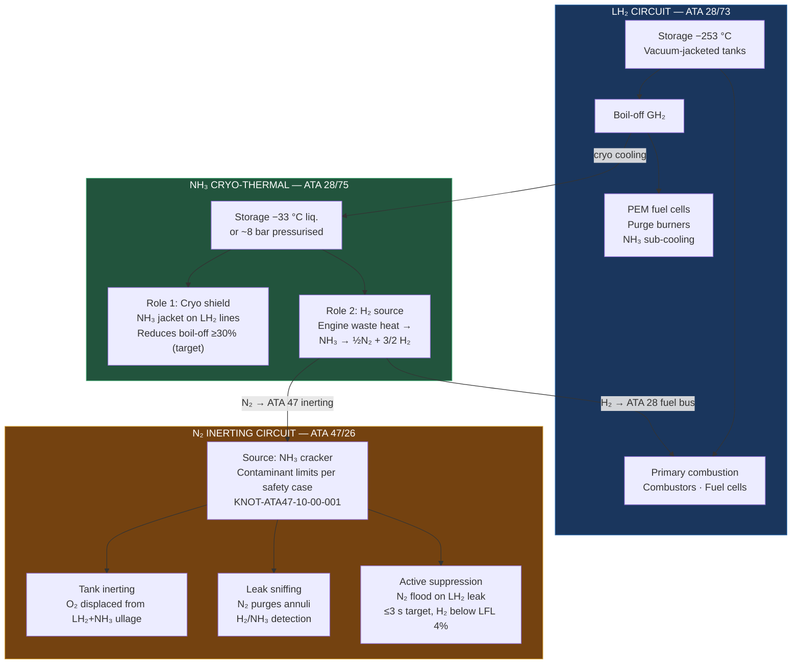
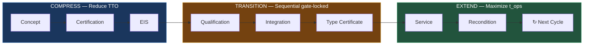

# AMPEL360 DB — DUAL BRANCH

## IDEALE-ESG · AMPEL360 Program Family · Dual Branch (WTW + BWB) · 100-Pax Configuration

### Zero-CO₂ Short-Haul Aircraft — AMPEL360 WTW (EIS 2035–40) · AMPEL360 BWB (EIS 2042–48)

<p align="center">
  
  
  
  
  
  
  
  
  
  
</p>

<p align="center">
  <strong>
    Certification-grade digital engineering baseline for the AMPEL360 dual-branch
    programme family: AMPEL360 WTW (Wide Tube &amp; Wing, 100-pax, LH₂ + NH₃
    cracking, EIS 2035–40) and AMPEL360 BWB (Blended Wing Body, LH₂ + PEM
    fuel cell, EIS 2042–48) — managed under the OPT-IN Framework, S1000D CSDB,
    and Teknia Token incentive system.
  </strong>
</p>

<p align="center">
  <a href="#1-program-identity">Identity</a> •
  <a href="#2-four-dimensional-ata-node-model">4D Model</a> •
  <a href="#3-propulsion-architecture">Propulsion</a> •
  <a href="#4-repo-organization">Repo</a> •
  <a href="#5-opt-in-5-axis-topology">OPT-IN</a> •
  <a href="#6-elastic-lifecycle">ELC</a> •
  <a href="#7-knot-register-seed">KNOTs</a> •
  <a href="#8-tokenomics-tt-v314">Tokenomics</a> •
  <a href="#9-csdb--publishing-model">CSDB</a> •
  <a href="#10-standards--compliance">Standards</a> •
  <a href="#11-automation--cicd">Automation</a> •
  <a href="#12-contributing">Contributing</a>
</p>

---

## 1. Program Identity — AMPEL360 DB (Dual Branch)

| Attribute | Value |
|---|---|
| **Programme family** | `AMPEL360 DB` — Dual Branch (WTW + BWB) |
| **Branch A — near-term** | `AMPEL360 WTW` (Wide Tube & Wing) · EIS 2035–2040 |
| **Branch B — long-horizon** | `AMPEL360 BWB` (Blended Wing Body) · EIS 2042–2048 |
| **Legacy ID** | `ID-A360-Q100` (superseded by IBD-001 Rev B) |
| **A360** | AMPEL360 program family heritage |
| **Q100** | Configuration — 100 passengers nominal (range 50–120 pax) |
| **AMPEL** | Program family name (see [Acknowledgments](#acknowledgments)) |
| **ESG pillar** | Environmental — net-zero aviation decarbonization |
| **Range target** | ≤ 2 500 km short-haul regional |
| **Pax nominal** | 100 (range 50–120) |
| **Certification basis** | EASA CS-25 Amendment 28 / FAA Part 25 (final basis confirmed per application date) |
| **CO₂ posture** | Zero at tailpipe (tank-to-wake). Lifecycle CO₂ depends on H₂/NH₃ production pathway — declared in I-INFRASTRUCTURES |
| **NOₓ target** | ≤ 5% of ICAO CAEP/8 LTO NOₓ limit (2010 baseline; re-validate at certification entry date) |
| **Domain governance** | `aircraftmodel.eu` — aviation decarbonization boundary |
| **Inheritance boundary** | [`AMPEL360-FAM-IBD-001 Rev B`](SSOT/LC04_DESIGN_REVIEW/AMPEL360-FAM-IBD-001-RevB.md) — shared-spine / forked-content declaration |
| **Config selection trade** | [`AMPEL360-WTW-TS-001 Rev A`](SSOT/LC04_DESIGN_REVIEW/AMPEL360-WTW-TS-001-Config-Selection.md) — WTW vs BWB multi-criterion trade study · **OPEN** (KNOT-CONF-00-00-001) |
| **Repository** | `github.com/AmedeoPelliccia/aircraftmodel` |
| **Concept & Direction** | Amedeo Pelliccia |

> **⚠ Domain boundary:** This repository operates exclusively under the
> `aircraftmodel.eu` governance charter (aviation decarbonization).
> Space-quantum and orbital infrastructure artifacts belong to
> `aerospacemodel.com`. Do not co-mingle across domain boundaries.

---

## 2. Four-Dimensional ATA Node Model

Every ATA chapter node in this programme carries **four orthogonal attributes**:

| Dimension | Attribute | Where defined | What it answers |
|---|---|---|---|
| **① STRUCTURE** | OPT-IN axis / cluster | [§5 OPT-IN Topology](#5-opt-in-5-axis-topology) | *Where* does this system live in the repo? |
| **② TIME** | ELC Family code → SLC phases → zone | [§6 Elastic Lifecycle](#6-elastic-lifecycle) | *How* does it mature through the lifecycle? |
| **③ UNCERTAINTY** | KNOT / KNU register | [§7 KNOT Register](#7-knot-register-seed) | *What* do we not yet know? |
| **④ INCENTIVE** | TT token pool | [§8 Tokenomics](#8-tokenomics-tt-v314) | *Who* gets rewarded for closing the uncertainty? |

> **OPT-IN ≠ ELC.** The OPT-IN topology is the **spatial** organization of
> engineering content. The Elastic Lifecycle (ELC) is the **temporal** schedule
> through which each node matures. Family codes (A–G) are a temporal attribute
> of each ATA node derived from its physical architecture — not a competing
> taxonomy.

---

## 3. Propulsion Architecture

### 3.1 Overview — The Closed-Loop Cryogenic Ecosystem

The AMPEL360 WTW propulsion system represents the convergence of Liquid Hydrogen
(LH₂) and Ammonia (NH₃) into a single self-reinforcing energy ecosystem:

- **LH₂** provides primary combustion energy (high energy density, zero CO₂ at tailpipe)
- **NH₃** acts as a dual-role agent: cryo-thermal shield for LH₂ lines *and*
  a secondary H₂ source via on-board catalytic cracking
- **N₂** produced by the cracker is captured and used as an active inert-gas
  safety agent by ATA 47 — turning a by-product into a safety resource

This tri-species closed loop eliminates boil-off venting, maximises energy
recovery, and generates its own inerting gas on-board.

> **Baseline posture (v0.1):** This repository defines a concept baseline and
> evidence plan. Performance, mass, emissions, and certification statements are
> **targets** until closed by LC02–LC07 evidence under the KNOT/KNU framework.
> No claim in this document constitutes a certified or substantiated design value.



### 3.2 ATA 28 — LH₂ Fuel Management & Boil-Off Control

Liquid hydrogen is stored at −253 °C in vacuum-jacketed double-wall tanks.

**Tank design:** Double-wall, vacuum-insulated. Candidate inner-wall material:
Al-Li 2195 alloy (subject to H₂-compatibility trade study — material selection
not yet substantiated). Contamination and cryogenic degradation modes
(including H₂ compatibility) are mitigated by material cleanliness,
moisture/oxygen exclusion coordinated with ATA 47, and surface treatment.
Tank pressure band: 1.5–3.5 bar absolute.

**Boil-off recovery loop** — GH₂ rising from natural vaporisation is never
vented. The ATA 28 controller routes it to one of three sinks in priority order:

1. PEM fuel cells → auxiliary electrical generation (ATA 24)
2. Engine purge burners → supplemental thrust
3. NH₃ sub-cooling heat exchanger → extends liquid hold time

**NH₃ cryo-shield integration:** Liquid ammonia circulates in a heat-exchanger
jacket surrounding the LH₂ feedlines. As an intermediate refrigerant at −33 °C,
it intercepts parasitic heat before it reaches the LH₂ stream, reducing
boil-off rate by ≥ 30 % (target — KNOT-ATA28-20-00-001).

### 3.3 NH₃ On-Board Cracker — Dual Role

| Function | Mechanism | ATA Reference |
|---|---|---|
| **Cryo-thermal shield** | NH₃ jacket around LH₂ lines; acts as intermediate refrigerant | ATA 28-20 |
| **Supplemental H₂ source** | Catalytic cracker uses engine waste heat: NH₃ → ½N₂ + 3/2 H₂ | ATA 28-40 / 75 |
| **N₂ generator** | N₂ from cracking captured and routed to ATA 47 inerting system | ATA 47-10 |

**Cracker thermodynamics:** NH₃ decomposition is endothermic (ΔH = +46 kJ/mol
NH₃). Balanced per mol NH₃: NH₃ → ½N₂ + 3/2 H₂ (equivalently: 2NH₃ → N₂ + 3H₂
per two moles — same stoichiometry). Engine bleed or waste heat at 400–600 °C
drives the reaction over a Ru/Al₂O₃ catalyst. Conversion efficiency target:
≥ 95 % at cruise conditions (target — KNOT-ATA28-40-00-001).

### 3.4 ATA 47 — Inert Gas System & Safety Orchestration

> **Naming:** ATA 47 is scoped as an **Inert Gas System**. The N₂ is generated
> as a means to an end (inerting + suppression), not as a product in its own right.

| Mode | Trigger | Action |
|---|---|---|
| **Continuous inerting** | Always-on during fuel operations | N₂ blanket in LH₂ + NH₃ tank ullage; O₂ < 2 % v/v |
| **Leak sniffing** | Periodic / continuous | N₂ pressurises inter-pipe annuli; downstream sensors monitor for H₂ or NH₃ |
| **Alarm cascade** | H₂ or NH₃ detected in N₂ exhaust | ATA 28 valve isolation + ATA 26 crew alert |
| **Active suppression** | LH₂ leak confirmed | High-pressure N₂ flood of affected zone; H₂ diluted below LFL (4 % v/v) within ≤ 3 s (target) |

**N₂ source:** Cracker exhaust — contaminant limits (NH₃, H₂, H₂O) to be
defined by ATA 47 safety case; target purity TBD per KNOT-ATA47-10-00-001.
Supplemented by a conventional molecular-sieve generator as back-up when the
cracker is not running (ground, engine-out).

### 3.5 Material Compatibility — Cross-Cutting (ATA 20 / 51)

All material data is centralised in the
[Material Characterization Library](OPT-IN_FRAMEWORK/T-TECHNOLOGIES/M-MECHANICS/ATA_20-STANDARD_PRACTICES/material-library/README.md).
All selections are **candidates** pending LC03/LC06 evidence.

| Species | Degradation mode | Candidate mitigation |
|---|---|---|
| **H₂** | H₂ compatibility / cryogenic material degradation | Candidate: Ti-6Al-4V for H₂-wetted surfaces (trade study open); ATA 47 O₂/H₂O/moisture exclusion; cleanliness |
| **NH₃** | Stress-corrosion cracking (SCC) of Cu alloys; N-assisted fatigue | Candidate: Hastelloy C-276 for NH₃-wetted surfaces (trade study open); N₂ drying |

### 3.6 Closed-Loop Synergy Summary

| Function | System | Action |
|---|---|---|
| LH₂ storage | ATA 28-10 | Maintains −253 °C; manages vapour pressure |
| Cryo cooling | NH₃ jacket (ATA 28-20) | Reduces LH₂ boil-off by ≥ 30 % (target) |
| H₂ supplementation | Cracker (ATA 28-40) | NH₃ → H₂ added to fuel bus |
| N₂ generation | ATA 47-10 (cracker exhaust) | Feeds inerting and suppression systems |
| Tank inerting | ATA 47-20 | O₂ < 2 % v/v in all fuel ullages |
| Leak detection | ATA 47-30 | Sniff protocol; continuous |
| Active suppression | ATA 47-40 | N₂ flood within ≤ 3 s (target) |
| Embrittlement control | ATA 20 / 51 | Material selection + O₂/H₂O exclusion (trade studies open) |

---

## 4. Repo Organization

```
AMPEL360-WTW/
│
├── README.md                              ← This file          [①STRUCTURE ②TIME ③UNCERTAINTY ④INCENTIVE]
├── CONTRIBUTING.md                        ← Contributor loop + placement rules
├── requirements.txt                       ← Python toolchain
│
├── OPT-IN_FRAMEWORK/                      ← ①STRUCTURE: 5-axis engineering topology
│   ├── O-ORGANIZATIONS/                   ATA 00–05  (SHARED)
│   ├── P-PROGRAMS/                        ATA 06–12  (SHARED)
│   ├── T-TECHNOLOGIES/                    ATA 20–98 on-board systems
│   │   ├── C2-CIRCULAR_CRYOGENIC_CELLS/   ★★ ATA 28, 85  (FORKED — critical path)
│   │   ├── E1-ENVIRONMENT/                ★★ ATA 26, 47  (FORKED)
│   │   ├── E2-ENERGY/                     ATA 24, 49  (FORKED)
│   │   ├── M-MECHANICS/                   ATA 20, 27, 29, 32  (SHARED/FORKED)
│   │   │   └── ATA_20-STANDARD_PRACTICES/
│   │   │       └── material-library/      ★ Centralised material data (SHARED)
│   │   └── P-PROPULSION/                  ATA 54, 60–83  (FORKED)
│   ├── I-INFRASTRUCTURES/                 H₂ / NH₃ GSE, cryo logistics
│   └── N-NEURAL_NETWORKS/                 ATA 46, 91–98  (SHARED)
│
├── SSOT/                                  ← Engineering truth (authoritative)
│   ├── README.md                          ← ②TIME: ELC document AMPEL360-FAM-ARCH-ELC-001 Rev B
│   ├── LC01_PROBLEM_STATEMENT/            ③UNCERTAINTY + ④INCENTIVE: KNOTS · KNU_PLAN · TT
│   ├── LC02 – LC14 .../
│   └── LC05_ANALYSIS_MODELS/
│       └── thermodynamic-models/          ★ OpenModelica baselines (LH₂/NH₃/N₂)
│
├── PUB/                                   ← Controlled deliverables
│   └── CSDB/
│       ├── DM/   PM/   DML/   ICN/
│       ├── BREX/ BREX-IDA360-Q100-v0.1.xml
│       ├── COMMON/   APPLICABILITY/
│       └── EXPORT/   IETP/
│
├── CAOS/                                  Continuous Airworthiness & Ops Sustainment
├── finance/ledger.json                    ④INCENTIVE: SHA-256 hash-chain TT ledger
│
├── tools/
│   ├── ci/
│   │   ├── optin_structure_validator.py   ★ Structure + traceability linter
│   │   ├── brex_validator.py              ★ BREX rules 001–005 enforcer
│   │   └── knot_issues_sync.py            ★ KNOT/KNU → GitHub Issues sync
│   └── knu_distribution.py               ★ TT distribution calculator + ledger
│
└── .github/
    ├── hooks/
    │   ├── pre-commit                     ★ SSOT boundary + traceability check
    │   └── setup-hooks.sh
    └── workflows/
        ├── brex-validation.yml            ★ BREX CI on PUB/CSDB/** changes
        ├── tt-distribution.yml            ★ Auto TT award on PR merge
        └── knot-issues-sync.yml           ★ CSV → GitHub Issues on push
```

**Placement rule:**

| Artifact is... | Place in... |
|---|---|
| Authoritative engineering evidence | `SSOT/` |
| Publishable or deliverable | `PUB/` |
| Formatted output (PDF, HTML, DOCX) | `PUB/EXPORT/` — **never** `SSOT/` |

---

## 5. OPT-IN 5-Axis Topology

Full inheritance from AMPEL360-COMMON shared spine ([`OPT-IN_FRAMEWORK/README.md`](OPT-IN_FRAMEWORK/README.md)).
AMPEL360 WTW-specific forks and extensions marked ★★.
IBD-001 boundary per [`AMPEL360-FAM-IBD-001 Rev B`](SSOT/LC04_DESIGN_REVIEW/AMPEL360-FAM-IBD-001-RevB.md).

### Axis O — ORGANIZATIONS (ATA 00–05) · **SHARED**

All governance, maintenance policy, and airworthiness content is identical
across both AMPEL360 WTW and AMPEL360 BWB.

| ATA | Chapter | IBD-001 |
|---|---|---|
| 00 | General | SHARED |
| 01 | Maintenance Policy | SHARED |
| 02 | Weight & Balance | SHARED |
| 03 | Minimum Equipment | SHARED |
| 04 | Airworthiness Limitations | SHARED |
| 05 | Time Limits / Maintenance Checks | SHARED |

### Axis P — PROGRAMS (ATA 06–12) · **SHARED**

Ground handling, dimensions, servicing, and placards are common across the family.

| ATA | Chapter | IBD-001 |
|---|---|---|
| 06 | Dimensions & Areas | SHARED |
| 07 | Levelling & Weighing | SHARED |
| 08 | Levelling (alternate) | SHARED |
| 09 | Towing & Taxiing | SHARED |
| 10 | Parking, Mooring, Storage & Return to Service | SHARED |
| 11 | Placards & Markings | SHARED |
| 12 | Servicing — Routine Maintenance | SHARED |

### Axis T — TECHNOLOGIES (ATA 20–98) · *Clustered*

T-TECHNOLOGIES is organized into clusters. SHARED clusters are maintained in
AMPEL360-COMMON; FORKED and MIXED clusters are maintained in this repo.

#### T/S — Structures · **FORKED**

Fuselage geometry, wing planform, and door placement diverge between WTW and BWB.

| ATA | Chapter | IBD-001 |
|---|---|---|
| 51 | Standard Practices & Structures — General | SHARED (std practices) |
| 52 | Doors | FORKED |
| 53 | Fuselage | FORKED |
| 54 | Nacelles / Pylons | FORKED |
| 55 | Stabilizers | FORKED |
| 56 | Windows | FORKED |
| 57 | Wings | FORKED |

#### T/A — Airframe Standard Practices & Material Library · **SHARED**

```
T-TECHNOLOGIES/M-MECHANICS/ATA_20-STANDARD_PRACTICES/
└── material-library/      ★ Centralised material data (SHARED)
```

| ATA | Chapter | IBD-001 |
|---|---|---|
| 20 | Standard Practices — Airframe | SHARED |

#### T/M — Mechanics · SHARED / FORKED

| ATA | Chapter | IBD-001 |
|---|---|---|
| 27 | Flight Controls | FORKED (WTW: conventional ailerons/elevator) |
| 29 | Hydraulic Power | SHARED (electro-hydraulic architecture) |
| 32 | Landing Gear | FORKED (WTW aft-heavy CG changes gear geometry) |

#### T/C2 — Circular Cryogenic Cells ★★ (Primary Innovation Node) · **FORKED**

```
T-TECHNOLOGIES/C2-CIRCULAR_CRYOGENIC_CELLS/ATA_28-FUEL/
├── 28-10-storage-reservoir/       ★★ LH₂ at −253 °C
├── 28-20-distribution/            ★★ NH₃ cryo-shield jacket on LH₂ lines
├── 28-30-dump-jettison/           ★★ Emergency discharge
├── 28-40-indicating/              ★★ NH₃ cracker H₂ feed + monitoring
├── 28-70-embrittlement-monitoring/★★ H₂ + NH₃ material health
└── 28-90-tables-schemas-index/
```

| ATA | Chapter | IBD-001 |
|---|---|---|
| 28 | Fuel (C² CELL — LH₂ + NH₃ tri-species) | FORKED (critical path) |
| 85 | Fuel Cell System | FORKED |

#### T/E1 — Environment (Inert Gas & Fire) ★★ · **FORKED**

```
T-TECHNOLOGIES/E1-ENVIRONMENT/ATA_47-INERT_GAS_SYSTEM/
├── 47-10-cracker-n2-sourcing-and-purity/  ★★ Contaminant limits per safety case
├── 47-20-tank-inerting-management/         ★★ O₂ < 2% ullage control
├── 47-30-leak-sniff-protocol/              ★★ Continuous N₂ purge/detect
├── 47-40-active-suppression-system/        ★★ ≤3 s N₂ flood on LH₂ leak (target)
├── 47-50-backup-mol-sieve-generator/       ★★ Ground / engine-out fallback
└── 47-90-tables-schemas-index/
```

| ATA | Chapter | IBD-001 |
|---|---|---|
| 21 | Air Conditioning (ECS) | SHARED |
| 25 | Equipment / Furnishings | SHARED (cabin) / FORKED (layout) |
| 26 | Fire Protection | FORKED (WTW: H₂+NH₃ dual-species zones) |
| 30 | Ice & Rain Protection | SHARED |
| 33 | Lights | SHARED |
| 35 | Oxygen | SHARED |
| 36 | Pneumatic | SHARED |
| 37 | Vacuum | SHARED |
| 38 | Water / Waste | SHARED |
| 44 | Cabin Systems | SHARED (cabin) / FORKED (layout) |
| 47 | Inert Gas System | FORKED (WTW: N₂ from cracker) |
| 50 | Cargo & Accessory Compartments | SHARED (cabin) / FORKED (layout) |

#### T/E2 — Energy · **FORKED**

| ATA | Chapter | IBD-001 |
|---|---|---|
| 24 | Electrical Power | FORKED (WTW: generator + FC auxiliary) |
| 49 | Airborne Auxiliary Power (APU) | FORKED |

#### T/P — Propulsion ★★ · **FORKED**

```
T-TECHNOLOGIES/P-PROPULSION/ATA_75-AIR/
└── 75-20-waste-heat-routing-to-cracker/  ★★ Engine bleed → 400–600 °C cracker
```

| ATA | Chapter | IBD-001 |
|---|---|---|
| 60 | Standard Practices — Propulsion | FORKED |
| 61 | Propellers / Propulsors | FORKED |
| 70 | Standard Practices — Engines | FORKED |
| 71 | Power Plant — General | FORKED |
| 72 | Engine | FORKED |
| 73 | Engine Fuel & Control | FORKED |
| 74 | Ignition | FORKED |
| 75 | Air (Bleed / Cooling / Waste Heat) | FORKED |
| 76 | Engine Controls | FORKED |
| 77 | Engine Indicating | FORKED |
| 78 | Exhaust | FORKED |
| 79 | Oil | FORKED |
| 80 | Starting | FORKED |
| 81 | Turbines (Reciprocating) | FORKED |
| 82 | Water Injection | FORKED |
| 83 | Accessory Gearboxes | FORKED |

#### T/D — Data · **SHARED**

| ATA | Chapter | IBD-001 |
|---|---|---|
| 31 | Indicating / Recording Systems | SHARED |
| 45 | Central Maintenance System (CMS) | SHARED |
| 46 | Information Systems | SHARED |

#### T/A2 — Avionics · **SHARED (core) / FORKED (FBW laws)**

| ATA | Chapter | IBD-001 |
|---|---|---|
| 22 | Auto Flight | SHARED (core) / FORKED (FBW laws) |
| 34 | Navigation | SHARED |
| 42 | Integrated Modular Avionics (IMA) | SHARED (core) / FORKED (FBW laws) |

#### T/C1 — Communications · **SHARED**

| ATA | Chapter | IBD-001 |
|---|---|---|
| 23 | Communications | SHARED |

#### T/I2 — AI/ML · **SHARED**

| ATA | Chapter | IBD-001 |
|---|---|---|
| 95 | Operational Dataload | SHARED |
| 97 | Wiring Reporting System | SHARED |

### Axis I — INFRASTRUCTURES · SHARED (H₂) / FORKED (NH₃)

H₂ ground supply chain and common GSE are maintained in AMPEL360-COMMON.
NH₃-specific couplings, hoses, and cracker feed interfaces are WTW-specific.

```
I-INFRASTRUCTURES/
├── ATA_IN_H2_GSE_AND_SUPPLY_CHAIN/         SHARED (green H₂ supply chain)
│   └── IN-50-nh3-gse-couplings-hoses-interfaces/  ★★ NH₃-specific (FORKED)
└── ATA_12-SERVICING_INFRA/
    └── 12-10-replenishing-equipment-and-points/   ★★ Dual-species refuelling panel
```

| Domain | IBD-001 |
|---|---|
| H₂ GSE and supply chain (production) | SHARED |
| NH₃ sourcing, handling, and cracker feed | FORKED |

### Axis N — NEURAL NETWORKS · **SHARED**

Traceability, DPP, ledger, and tokenomics framework are identical across
both AMPEL360 WTW and AMPEL360 BWB.

| ATA | Chapter | IBD-001 |
|---|---|---|
| 46 | Information Systems | SHARED |
| 91 | Wiring | SHARED |
| 92 | Electrical Components | SHARED |
| 95 | Operational Dataload | SHARED |
| 96 | Traceability & DPP | SHARED |
| 97 | Wiring Reporting System | SHARED |
| 98 | Ledger & Tokenomics | SHARED |

### Complete ATA-to-OPT-IN Mapping (all 71 chapters)

| ATA | Chapter | OPT-IN Axis/Cluster | IBD-001 |
|---|---|---|---|
| 00 | General | O-ORGANIZATIONS | SHARED |
| 01 | Maintenance Policy | O-ORGANIZATIONS | SHARED |
| 02 | Weight & Balance | O-ORGANIZATIONS | SHARED |
| 03 | Minimum Equipment | O-ORGANIZATIONS | SHARED |
| 04 | Airworthiness Limitations | O-ORGANIZATIONS | SHARED |
| 05 | Time Limits | O-ORGANIZATIONS | SHARED |
| 06 | Dimensions | P-PROGRAMS | SHARED |
| 07 | Levelling & Weighing | P-PROGRAMS | SHARED |
| 08 | Levelling (alt) | P-PROGRAMS | SHARED |
| 09 | Towing & Taxiing | P-PROGRAMS | SHARED |
| 10 | Parking / Storage | P-PROGRAMS | SHARED |
| 11 | Placards | P-PROGRAMS | SHARED |
| 12 | Servicing | P-PROGRAMS | SHARED |
| 20 | Standard Practices — Airframe | T/A Airframe | SHARED |
| 21 | Air Conditioning | T/E1 Environment | SHARED |
| 22 | Auto Flight | T/A2 Avionics | MIXED |
| 23 | Communications | T/C1 Comms | SHARED |
| 24 | Electrical Power | T/E2 Energy | FORKED |
| 25 | Equipment / Furnishings | T/E1 Environment | MIXED |
| 26 | Fire Protection | T/E1 Environment | FORKED |
| 27 | Flight Controls | T/M Mechanics | FORKED |
| 28 | Fuel (C² CELL) | T/C2 Cryo Cells ★★ | FORKED |
| 29 | Hydraulic Power | T/M Mechanics | SHARED |
| 30 | Ice & Rain Protection | T/E1 Environment | SHARED |
| 31 | Indicating / Recording | T/D Data | SHARED |
| 32 | Landing Gear | T/M Mechanics | FORKED |
| 33 | Lights | T/E1 Environment | SHARED |
| 34 | Navigation | T/A2 Avionics | SHARED |
| 35 | Oxygen | T/E1 Environment | SHARED |
| 36 | Pneumatic | T/E1 Environment | SHARED |
| 37 | Vacuum | T/E1 Environment | SHARED |
| 38 | Water / Waste | T/E1 Environment | SHARED |
| 42 | Integrated Modular Avionics | T/A2 Avionics | MIXED |
| 44 | Cabin Systems | T/E1 Environment | MIXED |
| 45 | Central Maintenance System | T/D Data | SHARED |
| 46 | Information Systems | T/D Data | SHARED |
| 47 | Inert Gas System | T/E1 Environment ★★ | FORKED |
| 49 | APU | T/E2 Energy | FORKED |
| 50 | Cargo & Accessory Compartments | T/E1 Environment | MIXED |
| 51 | Structures — General | T/S Structures | SHARED |
| 52 | Doors | T/S Structures | FORKED |
| 53 | Fuselage | T/S Structures | FORKED |
| 54 | Nacelles / Pylons | T/S Structures | FORKED |
| 55 | Stabilizers | T/S Structures | FORKED |
| 56 | Windows | T/S Structures | FORKED |
| 57 | Wings | T/S Structures | FORKED |
| 60 | Standard Practices — Propulsion | T/P Propulsion | FORKED |
| 61 | Propellers / Propulsors | T/P Propulsion | FORKED |
| 70 | Standard Practices — Engines | T/P Propulsion | FORKED |
| 71 | Power Plant — General | T/P Propulsion | FORKED |
| 72 | Engine | T/P Propulsion | FORKED |
| 73 | Engine Fuel & Control | T/P Propulsion | FORKED |
| 74 | Ignition | T/P Propulsion | FORKED |
| 75 | Air (Bleed / Cooling / Waste Heat) | T/P Propulsion ★★ | FORKED |
| 76 | Engine Controls | T/P Propulsion | FORKED |
| 77 | Engine Indicating | T/P Propulsion | FORKED |
| 78 | Exhaust | T/P Propulsion | FORKED |
| 79 | Oil | T/P Propulsion | FORKED |
| 80 | Starting | T/P Propulsion | FORKED |
| 81 | Turbines | T/P Propulsion | FORKED |
| 82 | Water Injection | T/P Propulsion | FORKED |
| 83 | Accessory Gearboxes | T/P Propulsion | FORKED |
| 85 | Fuel Cell System | T/C2 Cryo Cells | FORKED |
| 91 | Wiring | N-NEURAL NETWORKS | SHARED |
| 92 | Electrical Components | N-NEURAL NETWORKS | SHARED |
| 95 | Operational Dataload | N-NEURAL NETWORKS | SHARED |
| 96 | Traceability & DPP | N-NEURAL NETWORKS | SHARED |
| 97 | Wiring Reporting System | N-NEURAL NETWORKS | SHARED |
| 98 | Ledger & Tokenomics | N-NEURAL NETWORKS | SHARED |

---

## 6. Elastic Lifecycle

**Reference document:** [`SSOT/README.md`](SSOT/README.md)
— *Architectural Models Programming Elastic Lifecycle*
— **AMPEL360-FAM-ARCH-ELC-001 · Rev B · 2026-02-23**

The ELC defines how architectural models *programme* the lifecycle.
Architecture is not an input to the lifecycle — it *is* the lifecycle programme.

### Three-Zone Model



| Zone | Levers | Target |
|---|---|---|
| **COMPRESS** | Concurrent phases, virtual qualification, digital twin maturation | TTO → global minimum |
| **TRANSITION** | Sequential gate-locked qualification + certification evidence | Gate pass rate ≥ 0.85 |
| **EXTEND** | Condition-based maintenance, modular reconditioning, DPP circularity | `t_ops` → maximum |

> **Total Lifecycle Value = f(1/TTO, t_ops)**

### 11 SLC Phases

| Phase | Name | Zone |
|---|---|---|
| SLC01 | Uncertainty Register | COMPRESS |
| SLC02 | Technology Requirements | COMPRESS |
| SLC03 | Concept / Material Selection | COMPRESS |
| SLC04 | Design Definition | COMPRESS |
| SLC05 | Analysis & Simulation | COMPRESS |
| SLC06 | Qualification | TRANSITION |
| SLC07 | System Integration | TRANSITION |
| SLC08 | Certification | TRANSITION |
| SLC09 | Infrastructure Readiness | TRANSITION |
| SLC10 | Operations | EXTEND |
| SLC11 | Reconditioning | EXTEND |

### ELC Compiler — 6 Steps

The ELC Compiler reads architectural model properties and produces an executable
SLC instance. See [`SSOT/README.md §4`](SSOT/README.md) for the full specification.

| Step | Input | Output |
|---|---|---|
| **Step 1** — Family Classification | Physical View → make/buy, TRL | `family_code ∈ {A–G}` |
| **Step 2** — Phase Instantiation | family_code + Functional View | `slc_phases[]` |
| **Step 3** — Zone Assignment | phases + TRL + cert strategy | `zone_map{phase → zone}` |
| **Step 4** — Concurrency Map | Logical View + dependencies | DAG of phases |
| **Step 5** — Elasticity Parameters | All views + targets | YAML config per system |
| **Step 6** — Gate Criteria | phases + zones + cert | Entry/exit predicates |

### Family A–G Classification (ELC Compiler Step 1)

Family codes are a **temporal attribute** of each ATA node derived from its
physical architecture. They are *not* a competing taxonomy with OPT-IN axes.

| Family | Name | Examples |
|---|---|---|
| **A** | In-house structural manufacturing | ATA 51–57 (Structures) |
| **B** | Co-development with OEM partner | ATA 71–83 (Propulsion — engine partner) |
| **C** | Novel technology, TRL ≤ 5 | ATA 28, 47, 85 (**pacemaker family**) |
| **D** | Spec-driven procurement, TRL ≥ 7 | ATA 22, 34 (mature avionics) |
| **E** | DAL-governed software/hardware | ATA 22 FBW, ATA 76 engine controls |
| **F** | Airline-selected, catalogue-based | ATA 25 cabin, ATA 44 IFE |
| **G** | AI/ML, data-driven | ATA 95–98 (neural networks, DPP) |

> **Family C (H₂/Cryo) is the integration pacemaker.** Novel technology,
> special certification conditions, and longest transition zone (18 months
> estimated). All other families must align their transition zone exit to
> Family C readiness. Reference: [`SSOT/README.md §6.1`](SSOT/README.md).

---

Full register: `SSOT/LC01_PROBLEM_STATEMENT/KNOTS.csv`

| KNOT_ID | Title | Res. | Target | Pool (TT) | Close |
|---|---|---|---|---|---|
| KNOT-ATA28-10-00-001 | LH₂ Tank Structural Sizing | 100 | 10 | 120 | 2026-09-30 |
| KNOT-ATA28-20-00-001 | NH₃ Cryo-Shield Boil-Off Reduction | 100 | 10 | 150 | 2026-12-31 |
| KNOT-ATA28-40-00-001 | NH₃ Cracker Conversion Efficiency | 100 | 15 | **200** | 2027-03-31 |
| KNOT-ATA47-10-00-001 | Cracker N₂ Purity / Contaminants | 100 | 10 | 100 | 2027-03-31 |
| KNOT-ATA47-20-00-001 | Tank Inerting O₂ Control | 100 | 8 | 130 | 2027-06-30 |
| KNOT-ATA47-30-00-001 | Leak Sniff Protocol Sensitivity | 100 | 10 | 110 | 2027-06-30 |
| KNOT-ATA47-40-00-001 | Active N₂ Suppression ≤ 3 s | 100 | 5 | **180** | 2027-09-30 |
| KNOT-ATA28-70-00-001 | H₂ Embrittlement Monitoring | 100 | 12 | 90 | 2027-06-30 |
| KNOT-ATA75-20-00-001 | Waste Heat Routing to Cracker | 100 | 15 | 100 | 2026-12-31 |
| KNOT-ATA04-00-00-001 | ALIs for Cryo Systems | 100 | 10 | 80 | 2027-09-30 |
| KNOT-ATA53-10-00-001 | Fuselage Diameter Trade (IBD OI-1) | 100 | 15 | 100 | 2026-09-30 |
| KNOT-ATA32-10-00-001 | Landing Gear Yehudi Interference (IBD OI-3) | 100 | 15 | 90 | 2026-12-31 |
| KNOT-ATA55-10-00-001 | CG Envelope T-tail vs Canard (IBD OI-4) | 100 | 15 | 110 | 2026-12-31 |
| KNOT-ATA25-50-00-001 | NH₃ Containment Zone Crashworthiness (IBD OI-5) | 100 | 12 | 100 | 2027-06-30 |
| **TOTAL** | | | | **1 660 TT** | |

> **Critical path:** KNOT-ATA28-40-00-001 (Cracker Efficiency) is the anchor.
> ATA 47 inerting and waste heat routing are downstream dependencies.
> IBD open items (OI-1 through OI-5) feed the WTW viability gate per
> [AMPEL360-FAM-IBD-001 Rev B](SSOT/LC04_TRADE_STUDIES/AMPEL360-FAM-IBD-001-RevB.md).

---

## 7. Tokenomics — TT v3.14

```yaml
# TOKENOMICS_TT.yaml template (per KNOT)
allocation:
  method: "effort_plus_impact"
  params:
    alpha_effort: 0.30      # 30% weight on effort
    alpha_impact: 0.70      # 70% weight on impact
    lambda_spillover: 0.50  # cross-KNOT spillover credit
```

| Operation | Fee Rate |
|---|---|
| KNU reward distribution | 0.5% |
| Transfer (π-tier) | 0.314% |
| Transfer (standard) | 0.99% |
| Transfer (large) | 3.14% |

Ledger: `finance/ledger.json` — SHA-256 hash chain, append-only.

---

## 8. CSDB & Publishing Model

### BREX — Five Mandatory Project Rules

| Rule | Scope | Requirement | CI behaviour |
|---|---|---|---|
| `BREX-IDA360-001` | ATA 28 DMs | `<cautionRef>` to H₂ compatibility caution | **FAIL build** |
| `BREX-IDA360-002` | Any DM with NH₃ content | `<warningRef>` to NH₃ toxicity warning | **FAIL build** |
| `BREX-IDA360-003` | ATA 47-40 procedural DMs | `respTime` attribute (seconds) on all steps | **FAIL build** |
| `BREX-IDA360-004` | All DMs with applicability | Use only approved variant values | **FAIL build** |
| `BREX-IDA360-005` | ATA 26 / 28 / 47 DMs | `safetyClass="SC1"` on `dmStatus` | **FAIL build** |

---

## 9. Standards & Compliance

| Standard | Application |
|---|---|
| **EASA CS-25 Amdt 28 / FAA Part 25** | Airworthiness requirements framing (final certification basis confirmed per application date) |
| **EASA SC-H₂ Special Condition (draft)** | Liquid hydrogen fuel system requirements |
| **ATA iSpec 2200** | Chapter / section / subject scaffolding |
| **S1000D Issue 5.0** | Technical publications CSDB (BREX-IDA360-Q100-v0.1) |
| **DO-178C** | Software — fuel management + inerting controllers |
| **DO-254** | Hardware — cracker controller, N₂ suppression valve driver |
| **DO-160H** | Environmental qualification for cryo-zone electronics |
| **SAE AS6858** | Hydrogen fuel system airworthiness (reference) |
| **ISO 15926** | Industrial data lifecycle standards |
| **REACH / CLP** | NH₃ handling chemical classification (ground ops) |

---

## 10. Automation & CI/CD

Install the full automation layer:

```bash
pip install -r requirements.txt
bash .github/hooks/setup-hooks.sh
```

### GitHub Actions Workflows

| Workflow | Trigger | What it does |
|---|---|---|
| `brex-validation.yml` | PR / push → `PUB/CSDB/**` | XML well-formedness; BREX-IDA360-001–005; ICN reference resolution. **Fails build on violation.** |
| `tt-distribution.yml` | PR merged containing KNU ID | Runs distribution formula; commits `AWARDS_TT.csv` + `ledger.json`; posts award summary to PR. |
| `knot-issues-sync.yml` | Push → `LC01/*.csv` or manual | Parses KNOTS + KNUs; creates/updates GitHub Issues with ATA labels and status. |

### Pre-Commit Hook

Rejects at commit time:

- `.pdf`, `.html`, `.docx` anywhere in `SSOT/`
- Raw `.csv` inside `PUB/CSDB/DM/`
- LC02–LC14 artifacts (> 5 lines) with no KNU ID reference
- Commit messages with no KNU/KNOT ID and no exempt prefix (`chore:`, `ci:`, `docs:`, `fix:`)

### Local Commands

```bash
# Structure validation
python tools/ci/optin_structure_validator.py --check
python tools/ci/optin_structure_validator.py --check --chapter 28
python tools/ci/optin_structure_validator.py --check --strict   # warnings = errors

# BREX validation
python tools/ci/brex_validator.py --dm-dir PUB/CSDB/DM

# TT tooling
python tools/knu_distribution.py quote --op reward --tt 200
python tools/knu_distribution.py verify
```

### Thermodynamic Simulation Baseline (LC05)

`SSOT/LC05_ANALYSIS_MODELS/thermodynamic-models/` defines OpenModelica 1D
simulation standard — one folder per KNOT, `KNU_EVIDENCE.md` template with
`delta_residual_primary` field feeding directly into the TT formula, and CI
integration for automated acceptance criteria checking.

---

## 11. Contributing

See **[CONTRIBUTING.md](./CONTRIBUTING.md)** for the full contributor loop.

```
1. CLAIM  → Assign a KNU ID from SSOT/LC01_PROBLEM_STATEMENT/KNU_PLAN.csv
2. DRAFT  → Develop engineering artifact in SSOT/LCxx/ — include KNU ID in header
3. PUB    → Author S1000D DM in PUB/CSDB/DM/ if KNU_Type = PUB (BREX-validated)
4. TRACE  → Pre-commit hook enforces KNU ID presence in LC02–LC14 artifacts
5. PR     → Include KNU ID in PR title/body → CI auto-awards TT on merge
```

| Rule | Guidance |
|---|---|
| Narrative docs | `.md` only — never `.pdf` or `.docx` |
| Matrices / logs | `.csv` only — never `.xlsx` |
| Material data | Reference `material-library/` — no local definitions |
| Safety-critical DMs | `safetyClass="SC1"` + DO-178C/254 compliance tag |
| LH₂ DMs | `<cautionRef>` to H₂ caution (BREX-IDA360-001) |
| NH₃ DMs | `<warningRef>` to NH₃ warning (BREX-IDA360-002) |
| KNOT / KNU | Define uncertainty in LC01 **before** producing any artifact |

---

## License

Creative Commons Zero v1.0 Universal — see [LICENSE](./LICENSE).

---

## Acknowledgments

- **Concept & Direction:** Amedeo Pelliccia
- **Brand:** IDEALE-ESG · AMPEL360 Program Family
  *(AMPEL = AMedeo PELliccia; 360 = panoramic, full-lifecycle engineering vision)*
- **AI Assistance:** LLM-aided drafting under controlled author review (Claude, Anthropic)
- **Framework:** OPT-IN Framework Standard v1.1
- **Tokenomics:** Teknia Token (TT) v3.14
- **Domain:** aircraftmodel.eu — aviation decarbonization

---

<p align="center">
  <strong>ID-A360-Q100</strong><br>
  IDEALE-ESG · AMPEL360 · 100-Pax · LH₂ + NH₃ Closed-Loop Zero-CO₂ Short-Haul
</p>
<p align="center">
  <em>By Amedeo Pelliccia · LLM-aided development under controlled author review · aircraftmodel.eu</em>
</p>
<p align="center">
  <i>Baseline v0.1 — 2026-02-22</i>
</p>
