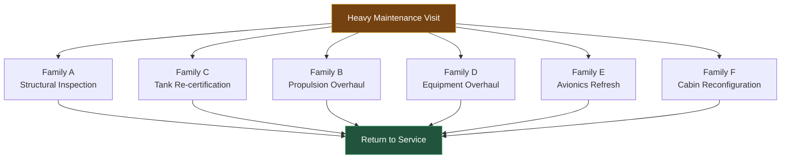

# HMV_COORDINATION_GRAPH.md
# Document ID: AMPEL360-FAM-ARCH-ELC-001-HMV
# Revision: A
# Date: 2026-02-23
# Parent Document: AMPEL360-FAM-ARCH-ELC-001 Rev B (§9 MRO & Reconditioning)
# Related Documents:
#   AMPEL360-FAM-ARCH-ELC-001-TPL-A (Family A — Structural, SLC11)
#   AMPEL360-FAM-ARCH-ELC-001-TPL-B (Family B — Propulsion, SLC11)
#   AMPEL360-FAM-ARCH-ELC-001-TPL-C (Family C — Novel H2, SLC11)
#   AMPEL360-FAM-ARCH-ELC-001-TPL-D (Family D — SFE, SLC11)
#   AMPEL360-FAM-ARCH-ELC-001-TPL-E (Family E — Avionics/SW, SLC11)
#   AMPEL360-FAM-ARCH-ELC-001-TPL-F (Family F — BFE/Cabin, SLC11)

# Heavy Maintenance Visit — Cross-Family Coordination Graph

**AMPEL360-FAM-ARCH-ELC-001-HMV · Rev A · 2026-02-23**

---

## Revision History

| Rev | Date       | Author Role           | Change Summary                              |
|-----|------------|-----------------------|---------------------------------------------|
| A   | 2026-02-23 | System Architect (SA) | Initial release — HMV coordination model    |

---

## §1  Purpose

This document defines the **cross-family coordination model** for the
Heavy Maintenance Visit (HMV) on AMPEL360 aircraft. The HMV is the
synchronisation point at which all applicable system families execute
their SLC11 (Reconditioning) phase concurrently, culminating in a joint
**Return to Service (RTS)** gate.

The HMV coordination model governs:

- The parallel activation of family SLC11 scopes from a single HMV trigger
- The dependency relationships and critical path within the HMV window
- The conditions under which the joint RTS gate is reached and cleared
- The minimum completion criteria per family before RTS can be signed

> **Note on Family G (AI/ML):** Family G (ATA-46) does not participate in
> the physical HMV. Its SLC11 reconditioning cycle (model retraining) runs
> on a separate, software-driven trigger independent of the aircraft
> maintenance schedule. Family G data feeds from the HMV are recorded in
> the DPP and used as training data inputs for the next retraining cycle.

---

## §2  HMV Coordination Graph

---

## §3  HMV Trigger Conditions

The HMV is triggered by the **earliest** of the following conditions
across any participating family:

| Trigger | Governing Family | Reference |
|---------|-----------------|-----------|
| Structural fatigue interval reached (ALI hard-time) | Family A | `family_A_structures.yaml` extension_model |
| H2 tank re-certification interval elapsed | Family C | `family_C_novel_h2.yaml` extension_model |
| Engine shop visit (ESV) interval reached | Family B | `family_B_propulsion.yaml` extension_model |
| SFE hard-time overhaul interval | Family D | `family_D_sfe.yaml` extension_model |
| Avionics LRU hard-time or platform end-of-support | Family E | `family_E_avionics_sw.yaml` extension_model |
| Cabin refurbishment interval (operator-initiated) | Family F | `family_F_bfe_cabin.yaml` extension_model |

Once any trigger fires, programme planning SHALL optimise the HMV window
to batch all family SLC11 activities, minimising total aircraft
ground time.

---

## §4  Per-Family Scope at HMV

### Family A — Structural Inspection

**SLC11 scope** (from `family_A_structures.yaml`):

- Detailed structural inspection per SSID/ALI
- Repair of identified damage (dents, delaminations, corrosion)
- Life-limited fastener replacement at fatigue-critical joints
- Structural repair documentation; DPP update
- Re-certification of repaired structure if beyond approved repair limits

**Typical HMV duration:** 2 months (concurrent with other families)

**RTS gate criterion:** All inspections and repairs complete; structural
repair documentation approved; DPP updated; RTS sign-off.

---

### Family B — Propulsion Overhaul

**SLC11 scope** (from `family_B_propulsion.yaml`):

- Engine removal and transport to OEM/MRO shop
- Disassembly, inspection, repair/replace of life-limited parts
  (turbine blades, seals, discs)
- Nacelle inspection (thrust reverser, acoustic treatment, pylon)
- Engine reassembly, test cell run, and re-certification
- DPP update (all replaced life-limited parts with traceability)

**Typical HMV duration:** 3 months (engine shop visit runs off-wing;
aircraft ground time for removal/reinstallation ~3 weeks)

**RTS gate criterion:** Engine ESV complete; test cell run accepted;
engine re-certified; nacelle inspection sign-off; DPP updated.

---

### Family C — Tank Re-certification

**SLC11 scope** (from `family_C_novel_h2.yaml`):

- Inspect tank internal surfaces for H2 embrittlement and corrosion
- Replace insulation if degraded (borescope inspection)
- Replace finite-life components (seals, valves, sensors)
- Re-qualification test if any structural repair required
- DPP update; tank re-certification sign-off

**Typical HMV duration:** 3 months

**RTS gate criterion:** All inspections complete; life-limited parts
replaced; tank re-certified per H2 system maintenance programme; DPP
updated; RTS sign-off.

---

### Family D — Equipment Overhaul

**SLC11 scope** (from `family_D_sfe.yaml`):

- SFE item removal, transport to approved MRO or OEM overhaul shop
- Overhaul or repair per Component Maintenance Manual (CMM)
- Software reload to current approved version
- Replace obsolete items with updated compatible equipment per approved SB
- DPP update with overhaul traceability

**Typical HMV duration:** 1 month (parallel per LRU; fits within HMV window)

**RTS gate criterion:** All SFE items overhauled or replaced; DPP updated;
return-to-service documentation signed per item.

---

### Family E — Avionics Refresh

**SLC11 scope** (from `family_E_avionics_sw.yaml`):

- LRU removal and overhaul at approved avionics MRO
- Software reload to current approved version (LSAP process)
- Hardware replacement for obsolete LRUs per approved SB
- DPP update (LRU version, software version, modification state)
- Re-certification if modified LRU requires STC

**Typical HMV duration:** 1 month (parallel; fits within HMV window)

**RTS gate criterion:** All LRUs overhauled and returned; software at
current approved version; DPP updated; return-to-service complete.

---

### Family F — Cabin Reconfiguration

**SLC11 scope** (from `family_F_bfe_cabin.yaml`):

- Seat replacement (new BFE selection if operator-initiated)
- Galley and lavatory refurbishment
- IFE system upgrade (if applicable)
- Carpet and sidewall panel replacement
- ACL compliance confirmation for new BFE selection
- Structural inspection of seat tracks, overhead bin structure
- Emergency slide repack; oxygen system hydrostatic test
- DPP update for all replaced BFE items

**Typical HMV duration:** 2 months

**RTS gate criterion:** Cabin refurbishment complete; ACL compliance
confirmed; structural inspection sign-off; emergency equipment serviced;
DPP updated; RTS sign-off.

---

## §5  Return to Service (RTS) Gate

The **RTS gate** is a joint sign-off that requires **all** of the
following to be simultaneously satisfied:

| # | Criterion | Owner Role |
|---|-----------|-----------|
| 1 | Family A structural inspection and repair sign-off | Structures SA |
| 2 | Family B engine re-certification and test cell acceptance | Propulsion SA |
| 3 | Family C tank re-certification sign-off | H2 Systems SA |
| 4 | Family D SFE overhaul completion per all affected items | Systems SA |
| 5 | Family E avionics software and hardware at approved versions | Avionics SA |
| 6 | Family F cabin ACL compliance and structural inspection sign-off | Cabin SA |
| 7 | DPP updated with all HMV activity records | Programme Lead |
| 8 | No open airworthiness findings from any family | All SA |
| 9 | Maintenance release signed by approved certifying staff | Quality Authority |

The RTS gate is a **hard AND gate**: partial completion does not permit
return to service. Any family that cannot meet its RTS criterion within
the planned HMV window raises a **DRIFT event** in the ELC framework,
triggering programme-level review.

---

## §6  Critical Path

Under the standard HMV window, the critical path is driven by the
**longest-duration family SLC11 activity**:

| Path | Duration | Critical? |
|------|----------|-----------|
| Family B (engine ESV off-wing) | ~3 months | **Yes — critical path** |
| Family C (tank re-certification) | ~3 months | **Yes — tied critical path** |
| Family A (structural inspection) | ~2 months | No (float ~1 month) |
| Family F (cabin refurbishment) | ~2 months | No (float ~1 month) |
| Family D (SFE overhaul) | ~1 month | No (float ~2 months) |
| Family E (avionics refresh) | ~1 month | No (float ~2 months) |

Programme planning SHALL use this critical path to determine minimum HMV
window duration and to prioritise resource allocation to Family B and
Family C activities.

---

## §7  DPP Integration

Every HMV activity MUST be recorded in the aircraft's **Digital Product
Passport (DPP)** at the appropriate granularity level per family:

| Family | DPP Granularity | Record Content |
|--------|----------------|----------------|
| A | Assembly level | Inspection results, repairs, RTS sign-off |
| B | Component level | Replaced life-limited parts, ESV report reference, test cell run reference |
| C | Component level | Inspection results, replaced parts, tank re-certification document reference |
| D | Equipment item | Overhaul shop, CMM issue used, software version loaded |
| E | LRU | Overhaul shop, software version (part number + version), modification state |
| F | BFE item | New BFE selection (if changed), refurbishment scope, ACL version |

The DPP record for each HMV event is anchored as a PNR `RECOND` event
(per `AMPEL360-FAM-ARCH-ELC-001-PNR §3.1`) when the PNR Thread is active
for the reconditioning cycle.

---

<em>AMPEL360 · Heavy Maintenance Visit Coordination Graph · AMPEL360-FAM-ARCH-ELC-001-HMV Rev A</em>

