# Architectural Models Programming Elastic Lifecycle

**AMPEL360-FAM-ARCH-ELC-001 · Rev B · 2026-02-23**

---

## 1  Purpose

This document defines how **architectural models** drive the instantiation,
configuration, and execution of **elastic lifecycle (ELC)** pipelines across
the AMPEL360 Q100 programme. The lifecycle is not a static process map —
it is programmable infrastructure whose shape, concurrency, and duration
are determined by the architecture of the system it governs.

> **Core thesis:** the architecture of a system *is* the programme for
> its lifecycle. Read the architecture → derive the lifecycle → execute
> with elasticity → measure → optimize.

---

## 2  Conceptual Framework

```mermaid
graph TD
    subgraph ARCHITECTURAL_MODEL_STACK["Architectural Model Stack"]
        FV["🔷 FUNCTIONAL VIEW<br/>Functions · Flows · Modes"]
        PV["🔶 PHYSICAL VIEW<br/>Components · Materials · Geometry"]
        LV["🔷 LOGICAL VIEW<br/>Interfaces · Protocols · Data Buses"]
        OV["🔶 OPERATIONAL VIEW<br/>Scenarios · Missions · Failure"]
    end

    subgraph COMPILER["ELC Compiler"]
        C1["Architecture → SLC"]
        C2["Properties → Params"]
        C3["Constraints → Gates"]
        C4["Interfaces → Deps"]
    end

    subgraph INSTANCE["ELC Instance"]
        I1["SLC Phases"]
        I2["Zone Assignments"]
        I3["Concurrency Map"]
        I4["Elasticity Params"]
        I5["Gate Criteria"]
        I6["KPI Targets"]
    end

    FV --> COMPILER
    PV --> COMPILER
    LV --> COMPILER
    OV --> COMPILER
    COMPILER --> INSTANCE
```



The four architectural views are **inputs**. The ELC Compiler maps
architectural properties to lifecycle parameters. The ELC Instance is
the executable lifecycle programme for that system.

---

## 2.1  Elastic Lifecycle Principle

```mermaid
graph LR
    subgraph COMPRESS["COMPRESS — TTO Reduction"]
        direction LR
        CON["Concept"] --> CERT["Certification"] --> EIS["EIS"]
    end

    subgraph EXTEND["EXTEND — Operational Life"]
        direction LR
        SVC["Service"] --> REC["Recondition"] --> LOOP["↻ Next Cycle"]
    end

    EIS --> SVC

    style COMPRESS fill:#1a365d,stroke:#2b6cb0,color:#fff
    style EXTEND fill:#22543d,stroke:#38a169,color:#fff
```



| Zone | Levers | Target |
|------|--------|--------|
| **COMPRESS** | Concurrent phases, virtual qualification, early supplier engagement, digital twin maturation, reduce Time To Operations (TTO) | `TTO = T_DEV + T_CERT` (total development + certification duration); Target: `TTO → global minimum per family` |
| **EXTEND** | Condition-based maintenance, modular reconditioning, digital twin life extension, DPP circularity | `t_ops → maximum` |

> **Total Lifecycle Value = f(1/TTO , t_ops)**
>
> `TTO` is the Time To Operations, defined as the total calendar duration
> from programme start to Entry Into Service: `TTO = T_EIS - T_start`.
> The compression levers reduce TTO by shortening `T_DEV` and `T_CERT`
> within it. Every phase, gate, and artifact exists to either **reduce TTO**
> or **lengthen time-in-service**. If it does neither, it is overhead.

---

## 3  Architectural Views as LC Drivers

Each architectural view contributes specific information that shapes the
elastic lifecycle:

### 3.1  Functional View → Phase Sequence

The functional decomposition determines **what must be engineered** and
therefore which SLC phases are required:

```mermaid
graph LR
    subgraph FUNCTIONAL_VIEW["Functional View Properties"]
        FN["Function Count"]
        NOV["Function Novelty<br/>(TRL)"]
        CRIT["Function Criticality<br/>(DAL)"]
        COUP["Function Coupling"]
        MOD["Function Modes"]
    end

    subgraph LC_CONSEQUENCES["LC Consequences"]
        KN["KNOT register depth"]
        ZA["Zone allocation<br/>(low TRL → longer compress)"]
        AP["Assurance phases<br/>(verification, safety case)"]
        IC["Integration phase<br/>complexity"]
        EC["Extension zone<br/>monitor coverage"]
    end

    FN --> KN
    NOV --> ZA
    CRIT --> AP
    COUP --> IC
    MOD --> EC
```



**Rule:** if a function is novel (TRL ≤ 4), the system cannot skip any
compression phase. If a function is mature (TRL ≥ 7), compression phases
can be collapsed or parallelized.

### 3.2  Physical View → Supply Chain Model

The physical architecture determines **how the system is procured and built**
and therefore which family template applies:


**Rule:** physical modularity directly determines reconditioning cycle
count. A monolithic structure has fewer reconditioning paths than a
modular assembly.

### 3.3  Logical View → Interface Dependencies

The logical architecture determines **how systems connect** and therefore
the integration and verification strategy:

| Logical Property | LC Consequence |
|------------------|----------------|
| Interface count | ICD phases required; integration test matrix size |
| Interface type (analog/digital/fluid/structural) | Verification method per interface |
| Bus topology (ARINC 429, 664, CAN, proprietary) | Avionics lab configuration; Family E applicability |
| Data rate / latency requirements | Real-time verification phases |
| Redundancy architecture | Common-mode analysis in safety case |

**Rule:** the system with the most cross-family interfaces determines
the critical path through the transition zone. This system is the
**integration pacemaker**.

### 3.4  Operational View → Extension Zone Programming

The operational architecture determines **how the system lives in service**
and therefore the extension zone strategy:

| Operational Property | LC Consequence |
|----------------------|----------------|
| Mission profile (cycles, hours, environments) | Fatigue/life allocation → DSG baseline |
| Maintenance concept (on-condition, hard-time, CM) | MRO phase content; monitoring instrumentation |
| Inspection access | SHM requirements; virtual inspection potential |
| Failure consequence (safety, dispatch, economic) | Monitoring granularity in extension zone |
| Reconfiguration frequency | Cabin refresh cycles (Family F); SW update cycles (Family E/G) |
| End-of-life scenario (scrap, recondition, reuse) | Reconditioning phase depth; DPP requirements |

**Rule:** the extension zone is only as long as the architecture allows.
An uninspectable structure cannot be life-extended. A non-modular system
cannot be reconditioned. Architecture decisions in the compression zone
**programme** the extension zone.

### 3.5  LC↔SLC Phase Mapping

The repository lifecycle directories (LC01–LC12) operate at the **aircraft
programme level**. System families execute **System Lifecycle (SLC)** phases
within each LC phase. The table below formalises this relationship.
Machine-readable form: `LC01_PROBLEM_STATEMENT/LC_SLC_MAPPING.yaml`.

| Aircraft LC Phase | Repository Directory | System SLC Phases | Zone | Relationship |
|---|---|---|---|---|
| LC01 Problem Statement | `LC01_PROBLEM_STATEMENT/` | SLC01 Uncertainty Register | Compress | Aircraft LC01 instantiates system-level KNOT registers |
| LC02 Requirements | `LC02_REQUIREMENTS/` | SLC02 Technology Requirements | Compress | Aircraft requirements decompose into system SLC02 per family |
| LC03 Preliminary Design | `LC03_PRELIMINARY_DESIGN/` | SLC03 Concept/Material, SLC04 Design | Compress | System families execute SLC03+SLC04 concurrently within LC03 |
| LC04 Design Review | `LC04_DESIGN_REVIEW/` | SLC04 Design (gate), SLC05 Analysis | Compress | Aircraft design review gates aggregate system SLC04/05 outputs |
| LC05 Analysis Models | `LC05_ANALYSIS_MODELS/` | SLC05 Analysis | Compress→Transition | System analysis models feed qualification evidence |
| LC06 Testing & PMU | `LC06_TESTING_PMU/` | SLC06 Qualification, SLC07 Integration | Transition | System qualification + integration tested at aircraft level |
| LC07 Industrial Qualification | `LC07_INDUSTRIAL_PROCESS_QUALIFICATION/` | SLC07 Integration (manufacturing) | Transition | Production process qualification |
| LC08 Flight Test & Cert | `LC08_FLIGHT_TEST_CERTIFICATION/` | SLC08 Certification | Transition | Aircraft-level certification aggregates system SLC08 |
| LC09 Industrial Plan | `LC09_INDUSTRIAL_PLAN/` | SLC09 Infrastructure | Transition | Production ramp-up |
| LC10 Fleet Operations | `LC10_FLEET_OPERATIONS/` | SLC10 Operations | Extend | In-service operations, monitoring, fleet data |
| LC11 MRO Plan | `LC11_MRO_PLAN/` | SLC11 Reconditioning | Extend | MRO execution per system family |
| LC12 Reconditioning | `LC12_RECONDITIONING/` | SLC11/SLC12 Reconditioning loop | Extend | System reconditioning cycles |

---

## 4  ELC Compiler: Architecture → Lifecycle

The ELC Compiler reads architectural model properties and produces an
executable SLC instance. The compilation process follows six steps:

```mermaid
graph TD
    S1["Step 1<br/>FAMILY CLASSIFICATION<br/>Physical View → Family A–G"]
    S2["Step 2<br/>PHASE INSTANTIATION<br/>Family + Functional View → SLC Phases"]
    S3["Step 3<br/>ZONE ASSIGNMENT<br/>TRL + Cert Strategy → Compress / Transition / Extend"]
    S4["Step 4<br/>CONCURRENCY MAP<br/>Logical View + Dependencies → DAG"]
    S5["Step 5<br/>ELASTICITY PARAMETERS<br/>All Views + Targets → Config"]
    S6["Step 6<br/>GATE CRITERIA<br/>Phases + Zones + Cert → Entry/Exit Predicates"]

    S1 --> S2 --> S3 --> S4 --> S5 --> S6

    style S1 fill:#2b6cb0,stroke:#1a365d,color:#fff
    style S2 fill:#2b6cb0,stroke:#1a365d,color:#fff
    style S3 fill:#2b6cb0,stroke:#1a365d,color:#fff
    style S4 fill:#2b6cb0,stroke:#1a365d,color:#fff
    style S5 fill:#2b6cb0,stroke:#1a365d,color:#fff
    style S6 fill:#2b6cb0,stroke:#1a365d,color:#fff
```



### Step 1 — Family Classification

```
INPUT:   Physical View (make/buy, supply chain, material maturity)
PROCESS: Classify against Family A–G criteria
OUTPUT:  family_code ∈ {A, B, C, D, E, F, G}
```

| Decision | Family |
|----------|--------|
| In-house design + structural manufacturing partner | A |
| Co-development with OEM partner (shared IP) | B |
| Novel technology, immature supply chain, TRL ≤ 5 | C |
| Spec-driven procurement, mature supplier, TRL ≥ 7 | D |
| DAL-governed software/hardware, DO-178C/254 scope | E |
| Airline-selected, late-configuration, catalogue-based | F |
| AI/ML model, data-driven, no established DO standard | G |

#### Family G — Regulatory Framework

Family G covers AI/ML models, data-driven systems, and digital services
(e.g., ATA-46 Information Systems). The regulatory landscape for AI/ML
in aviation is evolving. The following rules apply until formal adoption
of a dedicated standard:

1. **DAL Applicability.** Family G systems that interact with DAL A–C
   functions inherit the DAL of the most critical function they support.
   Standalone advisory-only Family G systems (no safety-critical output
   path) may operate at DAL D/E.

2. **DO-178C / DO-254 Interaction.** When a Family G model's output is
   consumed by a DO-178C or DO-254 system, the model is treated as a
   *tool* under **DO-330** (Software Tool Qualification). The Tool
   Qualification Level (TQL) is derived from the consuming system's DAL
   per DO-330 Table 11-1.

3. **Model Training Data Governance.** Training data must be
   configuration-controlled with traceability to data sources. Data
   provenance records are mandatory SSOT artefacts stored under the
   system's SLC phase directory (e.g., `SLC01/training_data_manifest.yaml`).

4. **Configuration Control of Weights/Parameters.** Trained model weights
   are treated as derived data products. Each release requires a
   hash-verified baseline stored in the SSOT. Model retraining triggers
   SLC recompilation per §7 (see Recompile Threshold Matrix §7.2 — treat
   as Family code unchanged, template version updated → **MANDATORY**).

5. **Applicable Standards Reference.** EASA AI Roadmap 2.0 and
   SAE ARP6983 (*Artificial Intelligence in Aeronautical Systems*) are
   the emerging regulatory frameworks. Until formal adoption, Family G
   systems follow a conservative interpretation applying DO-330 tool
   qualification as the primary compliance path.

### Step 2 — Phase Instantiation

```
INPUT:   family_code + Functional View
PROCESS: Instantiate SLC template; prune or expand phases per function set
OUTPUT:  slc_phases[] — ordered list of phases with content definitions
```

Pruning rules:

| Condition | Action |
|-----------|--------|
| All functions TRL ≥ 7, no novel materials | Collapse SLC03 (material/concept) into SLC02 |
| No safety-critical functions (DAL D or E only) | Reduce SLC08 (safety case) to checklist |
| Single-source supplier, proven product | Collapse SLC03+SLC04 (selection+review) into single gate |
| No physical hardware (pure software) | Skip tooling/FAI phases |
| No in-service reconfiguration | Remove reconfiguration phase from extension zone |

### Step 3 — Zone Assignment

```
INPUT:   slc_phases[] + TRL assessment + certification strategy
PROCESS: Assign each phase to COMPRESS / TRANSITION / EXTEND zone
OUTPUT:  zone_map{phase → zone}
```

| Zone | Criteria |
|------|----------|
| COMPRESS | Phase produces design, analysis, or planning artifacts; can overlap with other phases |
| TRANSITION | Phase produces qualification or certification evidence; must be sequential or gate-locked |
| EXTEND | Phase operates in service; can loop or recur |

### Step 4 — Concurrency Map


### Step 5 — Elasticity Parameters

```yaml
system_id: "ATA-28-C2-CELL"
family_code: "C"

compression:
  target_reduction_pct: 25
  virtual_credit_pct: 40
  concurrency_factor: 0.65
  knu_velocity_target: 8          # KNUs closed per month

transition:
  max_duration_months: 18
  gate_criteria_mode: "evidence"
  simulation_credit_accepted: true

extension:
  design_service_goal_fh: 60000
  reconditioning_cycles: 3
  monitoring_strategy: "condition_based"
  digital_twin_fidelity: "high"
  technology_refresh_interval_years: 10
  dpp_granularity: "component"

elasticity:
  eta_target: 12.0
  tto_max_months: 48
  t_ops_min_years: 40
```

### Step 6 — Gate Criteria Generation

Each gate is expressed as a predicate over KNU states:

```
GATE: SLC06 → SLC07 (Transition: Qualification → Integration)

ENTRY:
  ∀ knu ∈ SLC06.knus : knu.status ∈ {COMPLETE, ACCEPTED}
  residual(KNOT_parent) ≤ residual_target × 1.2
  brex_pass(all PUB artifacts) = true

EXIT:
  integration_test_matrix.coverage ≥ 95%
  interface_verification.all_icds_closed = true
  safety_case.updated = true
```

---

## 5  ELC Instance: Runtime Execution Model

Once compiled, the ELC Instance executes as a state machine:

```mermaid
stateDiagram-v2
    [*] --> Phase_Execute
    Phase_Execute --> Gate_Evaluate : artifacts produced
    Gate_Evaluate --> Phase_Execute : PASS → next phase
    Gate_Evaluate --> Blocked : FAIL
    Blocked --> Phase_Execute : dependency resolved
    Phase_Execute --> Metrics_Update : KNU closed
    Metrics_Update --> Phase_Execute

    state Phase_Execute {
        [*] --> Load_KNOTs
        Load_KNOTs --> Instantiate_KNUs
        Instantiate_KNUs --> Assign_RACI
        Assign_RACI --> Produce_Artifacts
        Produce_Artifacts --> Update_Residual
        Update_Residual --> [*]
    }

    state Metrics_Update {
        [*] --> Compute_TTO
        Compute_TTO --> Compute_t_ops
        Compute_t_ops --> Compute_eta
        Compute_eta --> Compute_KNU_velocity
        Compute_KNU_velocity --> [*]
    }
```



### 5.1  Phase Execution

```
PHASE.execute():
  1. Load KNOTs assigned to this phase
  2. For each KNOT:
     a. Instantiate planned KNUs
     b. Assign to contributors (RACI)
     c. Track effort + impact
  3. Produce artifacts → SSOT or PUB
  4. Update residual per KNOT
  5. Evaluate gate criteria
  6. If gate passes → emit PHASE_COMPLETE event
  7. If gate fails → emit PHASE_BLOCKED event + diagnostic
```

### 5.2  Concurrency Execution (Compression Zone)


### 5.3  Extension Zone Looping

```mermaid
graph TD
    EIS["Entry Into Service"] --> OPS["SLC_OPERATIONS<br/>Monitoring · CBM · Fleet Data"]
    OPS --> TRIGGER{"Reconditioning<br/>Trigger?"}
    TRIGGER -- No --> TWIN["Update Digital Twin"]
    TWIN --> OPS
    TRIGGER -- Yes --> RECON["SLC_RECONDITIONING<br/>Inspect · Repair · Recertify · DPP"]
    RECON --> VIABLE{"Reconditioning<br/>Viable?"}
    VIABLE -- Yes --> RTS["Return to Service"]
    RTS --> OPS
    VIABLE -- No --> RETIRE["Initiate Retirement"]

    style OPS fill:#22543d,stroke:#38a169,color:#fff
    style RECON fill:#744210,stroke:#d69e2e,color:#fff
    style RETIRE fill:#742a2a,stroke:#e53e3e,color:#fff
```



---

## 6  Cross-Family Orchestration

Systems do not mature in isolation. The ELC Compiler produces a
**programme-level orchestration graph** that manages dependencies
across families:


### 6.1  Integration Pacemaker

The **integration pacemaker** is the system family whose transition zone
determines the critical path to aircraft-level integration:


> **Family C (H₂/Cryo) is the pacemaker** — novel technology, special
> conditions, longest transition zone. All other families must align
> their transition zone exit to Family C's readiness.

### 6.2  Compression Synchronization

Families in the compression zone synchronize at **interface freeze points**:


| Sync Point | Families Involved | Trigger |
|------------|-------------------|---------|
| ICD Freeze | A + B + C + E | All interface definitions baselined |
| Loads Freeze | A + B | Structural loads + propulsion thrust cases agreed |
| Power Budget Freeze | C + D + E | Electrical load analysis closed |
| Weight Budget Freeze | All | Mass properties converged within allocation |
| Safety Architecture Freeze | A + B + C + D + E | FHA/PSSA complete; DAL allocated |

### 6.3  Extension Zone Coordination


> **Objective:** single heavy maintenance visit covers maximum
> reconditioning scope across families → extends aircraft operational
> life without multiplying downtime.

---

## 7  Architecture Decision Records as LC Mutations

When an architectural decision changes during the lifecycle, the ELC
Instance must **recompile** affected phases:


### 7.1  Common Mutations

| Mutation | Trigger | LC Consequence |
|----------|---------|----------------|
| Make → Buy | Cost/schedule pressure | Family A → D; compression increases; fewer design phases |
| Supplier change | Performance / risk | Re-enter SLC03; re-evaluate qualification evidence |
| TRL downgrade | Test failure | Extend compression zone; add prototype phase |
| DAL escalation | Safety analysis update | Add assurance phases (E); extend transition zone |
| Modularity increase | Reconditioning decision | Extend extension zone; add interfaces (transition cost) |
| Technology insertion | Mid-life upgrade | Partial recompile; new SLC for inserted technology |

### 7.2  Recompile Threshold Matrix

| Change Category | Change Type | Recompile Required | Justification |
|---|---|---|---|
| Family | Family code change (e.g., A→D) | **MANDATORY** | Entire SLC template changes |
| Family | Family code unchanged, template version updated | **MANDATORY** | Phase definitions may differ |
| TRL | TRL downgrade (any magnitude) | **MANDATORY** | Compression zone extends; phases added |
| TRL | TRL upgrade | CONDITIONAL (if phases can be pruned) | Validate pruning rules apply |
| DAL | DAL escalation | **MANDATORY** | Assurance phases added; transition zone extends |
| DAL | DAL de-escalation | CONDITIONAL (review safety case) | May remove phases; requires safety case update |
| Supplier | Supplier change, same specification | CONDITIONAL (re-evaluate SLC03 evidence) | Qualification evidence may not transfer |
| Supplier | Supplier change, different specification | **MANDATORY** | Re-enter SLC03 from scratch |
| Modularity | Modularity increase | **MANDATORY** | Extension zone deepens; new interfaces |
| Modularity | Modularity decrease | **MANDATORY** | Extension zone shortens; interfaces removed |
| Interface | Interface count change > 10% | **MANDATORY** | Integration test matrix changes |
| Interface | Interface count change ≤ 10% | CONDITIONAL (if no cross-family impact) | May only affect internal test matrix |
| Cosmetic | Documentation-only change | **NO** | No impact on SLC structure |
| Cosmetic | Metadata update (dates, names) | **NO** | No impact on SLC structure |

> **CONDITIONAL recompile rule:** CONDITIONAL recompiles require an ADR
> with justification for why full recompile is not needed. The ADR must be
> reviewed by the system architect and the ELC programme lead.

---

## 8  Data Model

### 8.1  ELC Instance Schema

```yaml
elc_instance:
  system_id: "ATA-28-10-00"
  system_name: "C² CELL Prime Material Storage"
  family_code: "C"
  family_name: "Novel Technology (H₂/Cryo)"

  architectural_drivers:
    functional:
      function_count: 12
      novel_functions: 8
      max_dal: "A"
      trl_range: [3, 5]
    physical:
      make_buy: "make"
      material_maturity: "low"
      modularity: "high"
      part_count: 340
    logical:
      interface_count: 28
      cross_family_interfaces: 14
      bus_types: ["ARINC 664", "discrete", "fluid", "structural"]
    operational:
      mission_cycles: 40000
      design_service_goal_fh: 60000
      maintenance_concept: "condition_based"
      reconditioning_target: 3

  phases:
    - id: "SLC01"
      name: "Uncertainty Register"
      zone: "compress"
      concurrent_with: []
      knot_count: 24
    - id: "SLC02"
      name: "Technology Requirements"
      zone: "compress"
      concurrent_with: ["SLC03"]
      knot_count: 18
    # ... (full phase list per Family C template)

  elasticity:
    eta_target: 12.0
    tto_target_months: 48
    t_ops_target_years: 40
    virtual_credit_target_pct: 40
    reconditioning_cycles: 3

  gate_criteria:
    - gate: "SLC06→SLC07"
      entry: "all SLC06 KNUs ACCEPTED; residual ≤ 12"
      exit: "integration test coverage ≥ 95%"
    # ... (full gate list)

  cross_family_dependencies:
    - dependency: "ICD_FREEZE"
      depends_on: ["ATA-53 (A)", "ATA-72 (B)", "ATA-24 (D)"]
      required_by: "SLC07_SYSTEM_INTEGRATION"
```
[https://claude.ai/public/artifacts/fad47190-e574-46f5-adcc-1103df4d775a](https://claude.ai/public/artifacts/fad47190-e574-46f5-adcc-1103df4d775a)

### 8.2  Family Template Schema

```yaml
family_template:
  code: "C"
  name: "Novel Technology Development (Cryogenic / H₂)"
  applies_to: ["ATA-28", "ATA-85"]

  phases:
    - id: "SLC01"
      name: "Uncertainty Register"
      zone: "compress"
      mandatory: true
      content: "KNOTs, KNUs, RACI, tokenomics"
      compression_lever: "Aggressive KNOT closure via rapid prototyping"

    - id: "SLC02"
      name: "Technology Requirements"
      zone: "compress"
      mandatory: true
      content: "Performance, safety, cryogenic envelope, boil-off budget"
      compression_lever: "Physics-based requirements; simulation-driven specs"

    # ... (full template)

  pruning_rules:
    - condition: "all functions TRL ≥ 6"
      action: "collapse SLC03 into SLC02"
    - condition: "no special conditions required"
      action: "remove SLC05; merge cert into SLC10"

  extension_model:
    loop_phases: ["SLC11", "SLC12"]
    loop_trigger: "reconditioning_interval OR condition_monitor_alert"
    max_cycles: 4
    exit_condition: "reconditioning_not_viable OR aircraft_retirement"
```

---

## 9  Metrics & Optimization

### 9.1  System-Level Metrics

| Metric | Formula | Target |
|--------|---------|--------|
| `TTO` | `T_EIS - T_programme_start` | → Global minimum per family |
| `t_ops` | EIS → last reconditioning cycle end | → Maximum |
| `η_elastic` | `t_ops / TTO` | ≥ 10 (programme), ≥ 12 (novel tech stretch) |
| `Δ_virtual` | virtual evidence hours / total evidence hours × 100 | ≥ 40% |
| `concurrency_factor` | actual parallel phases / max possible parallel phases | ≥ 0.6 |
| `KNU_velocity` | KNUs ACCEPTED / month (compression zone) | Per family target |
| `n_recon` | completed reconditioning cycles | Per family target |
| `gate_pass_rate` | gates passed first attempt / total gate attempts | ≥ 0.85 |

### 9.2  Programme-Level Optimization

```mermaid
graph TD
    OBJ["PROGRAMME OBJECTIVE"]
    MIN["Minimize Σ(TTO_i)<br/>for all systems i"]
    MAX["Maximize min(t_ops_i)<br/>weakest link rule"]

    OBJ --> MIN
    OBJ --> MAX

    subgraph CONSTRAINTS["Subject To"]
        C1["η_elastic_i ≥ 10 ∀ systems"]
        C2["Pacemaker alignment<br/>(all transition exits synced)"]
        C3["Budget ≤ programme ceiling"]
        C4["TC date ≤ EIS - 12 months"]
    end

    MIN --> CONSTRAINTS
    MAX --> CONSTRAINTS

    style OBJ fill:#1a365d,stroke:#2b6cb0,color:#fff
    style CONSTRAINTS fill:#553c9a,stroke:#805ad5,color:#fff
```



> **The weakest link rule:** aircraft operational life is bounded by the
> system with the shortest extension zone. Optimization must focus on
> extending the life-limiting system, not the easiest one.

### 9.3  Feedback Loop


---

## 10  Implementation in Repository

```
SSOT/
├── LC01_PROBLEM_STATEMENT/
│   ├── KNOTS.csv                        # Aircraft-level KNOTs
│   ├── ELC_FAMILY_ASSIGNMENTS.csv       # ATA → Family mapping
│   └── ELC_ORCHESTRATION_GRAPH.yaml     # Cross-family dependencies
│
├── LC02_REQUIREMENTS/
│   └── ELC_ELASTICITY_TARGETS.yaml      # Programme-level η targets
│
├── LC05_ANALYSIS_MODELS/
│   └── ELC_COMPILER/
│       ├── family_templates/
│       │   ├── family_A_structures.yaml
│       │   ├── family_B_propulsion.yaml
│       │   ├── family_C_novel_h2.yaml
│       │   ├── family_D_sfe.yaml
│       │   ├── family_E_avionics_sw.yaml
│       │   ├── family_F_bfe_cabin.yaml
│       │   └── family_G_ai_ml.yaml
│       ├── compiler.py                  # Architecture → SLC compiler
│       ├── scheduler.py                 # Concurrency execution engine
│       └── metrics.py                   # η_elastic, KNU_velocity, etc.
│
└── OPT-IN_FRAMEWORK/.../ATA_XX/SSOT/
    ├── ELC_INSTANCE.yaml                # Compiled SLC for this system
    ├── SLC01_UNCERTAINTY_REGISTER/
    ├── SLC02_.../
    └── ...                              # Family-specific SLC phases
```

---

## 11  Governance

| Rule | Description |
|------|-------------|
| Every ATA node declares `family_code` in its README | Family assignment is explicit and auditable |
| Every SLC phase declares its zone | Compression, transition, or extension is visible |
| ELC recompilation requires ADR (Architecture Decision Record) | Mutations are traceable |
| Elasticity metrics reported at each aircraft LC gate | η_elastic is a gate criterion |
| Extension zone data feeds LC_MEMORIES and LC-X_LESSONS_LEARNED | Feedback loop is mandatory |
| Pacemaker family identified and tracked | Critical path is explicit |
| All architectural diagrams use Mermaid notation | Versionable, diffable, renderable in GitHub/IETP |

---

## 12  Diagram Notation Standard

All diagrams in this document and throughout the AMPEL360 programme
use **Mermaid** as the enforced representation format:

| Diagram Type | Mermaid Syntax | Use Case |
|--------------|----------------|----------|
| Process flows | `graph TD` / `graph LR` | ELC Compiler steps, data flows, orchestration |
| State machines | `stateDiagram-v2` | Phase execution, runtime engine |
| Sequences | `sequenceDiagram` | Scheduler interactions, gate evaluations |
| Timelines | `gantt` | Transition zone durations, pacemaker visualization |
| Dependencies | `graph` with subgraphs | Cross-family orchestration, freeze points |

**Rationale:**
- Mermaid is text-based → versionable in Git, diffable in PRs
- Renders natively in GitHub, GitLab, Notion, and most IETP viewers
- No binary diagram files (`.vsdx`, `.drawio`) in SSOT
- Consistent visual language across all programme documentation

> ASCII art is **deprecated** as of Rev B. All new diagrams must use Mermaid.
> Existing ASCII diagrams will be migrated progressively.

---

<p align="center"><em>AMPEL360 Q100 · Architectural Models Programming Elastic Lifecycle · IDEALE-EU Programme</em></p>
